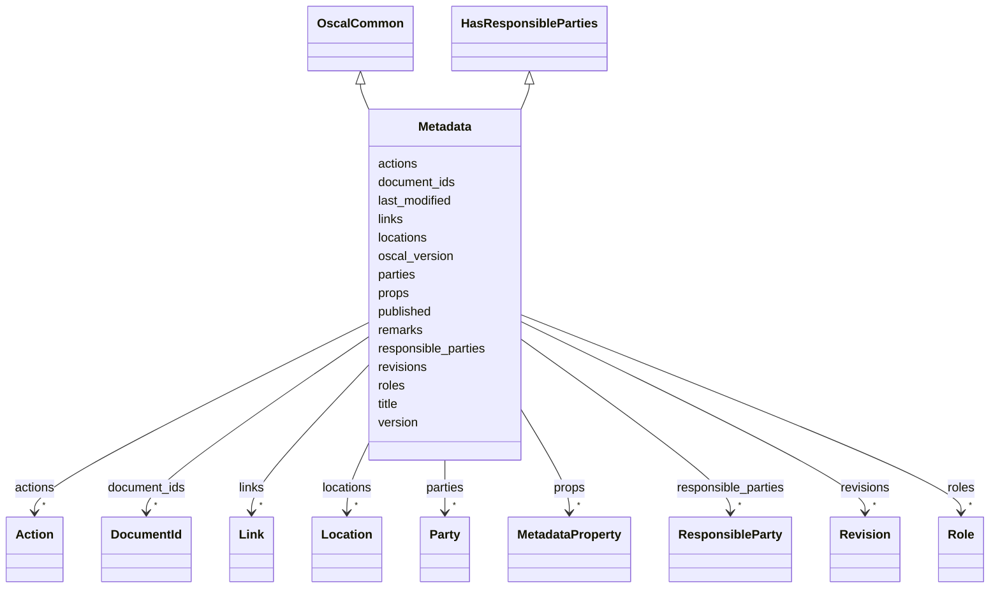

```mermaid
 classDiagram
    class Metadata
    click Metadata href "../Metadata"
      OscalCommon <|-- Metadata
        click OscalCommon href "../OscalCommon"
      HasResponsibleParties <|-- Metadata
        click HasResponsibleParties href "../HasResponsibleParties"
      
      Metadata : actions
        
          
    
        
        
        Metadata --> "*" Action : actions
        click Action href "../Action"
    

        
      Metadata : document_ids
        
          
    
        
        
        Metadata --> "*" DocumentId : document_ids
        click DocumentId href "../DocumentId"
    

        
      Metadata : last_modified
        
      Metadata : links
        
          
    
        
        
        Metadata --> "*" Link : links
        click Link href "../Link"
    

        
      Metadata : locations
        
          
    
        
        
        Metadata --> "*" Location : locations
        click Location href "../Location"
    

        
      Metadata : oscal_version
        
      Metadata : parties
        
          
    
        
        
        Metadata --> "*" Party : parties
        click Party href "../Party"
    

        
      Metadata : props
        
          
    
        
        
        Metadata --> "*" MetadataProperty : props
        click MetadataProperty href "../MetadataProperty"
    

        
      Metadata : published
        
      Metadata : remarks
        
      Metadata : responsible_parties
        
          
    
        
        
        Metadata --> "*" ResponsibleParty : responsible_parties
        click ResponsibleParty href "../ResponsibleParty"
    

        
      Metadata : revisions
        
          
    
        
        
        Metadata --> "*" Revision : revisions
        click Revision href "../Revision"
    

        
      Metadata : roles
        
          
    
        
        
        Metadata --> "*" Role : roles
        click Role href "../Role"
    

        
      Metadata : title
        
      Metadata : version
        
      
```
