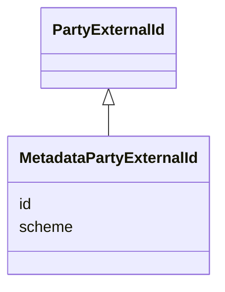

```mermaid
 classDiagram
    class MetadataPartyExternalId
    click MetadataPartyExternalId href "../MetadataPartyExternalId"
      PartyExternalId <|-- MetadataPartyExternalId
        click PartyExternalId href "../PartyExternalId"
      
      MetadataPartyExternalId : id
        
      MetadataPartyExternalId : scheme
        
      
```
