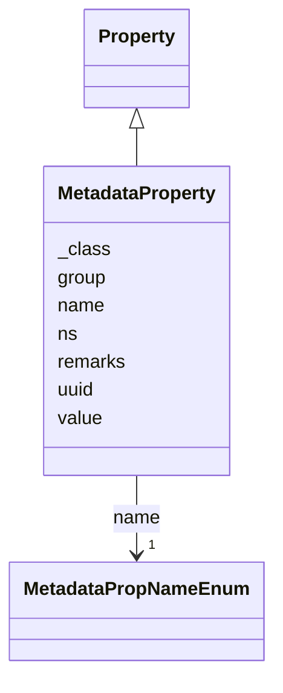

```mermaid
 classDiagram
    class MetadataProperty
    click MetadataProperty href "../MetadataProperty"
      Property <|-- MetadataProperty
        click Property href "../Property"
      
      MetadataProperty : _class
        
      MetadataProperty : group
        
      MetadataProperty : name
        
          
    
        
        
        MetadataProperty --> "1" MetadataPropNameEnum : name
        click MetadataPropNameEnum href "../MetadataPropNameEnum"
    

        
      MetadataProperty : ns
        
      MetadataProperty : remarks
        
      MetadataProperty : uuid
        
      MetadataProperty : value
        
      
```
