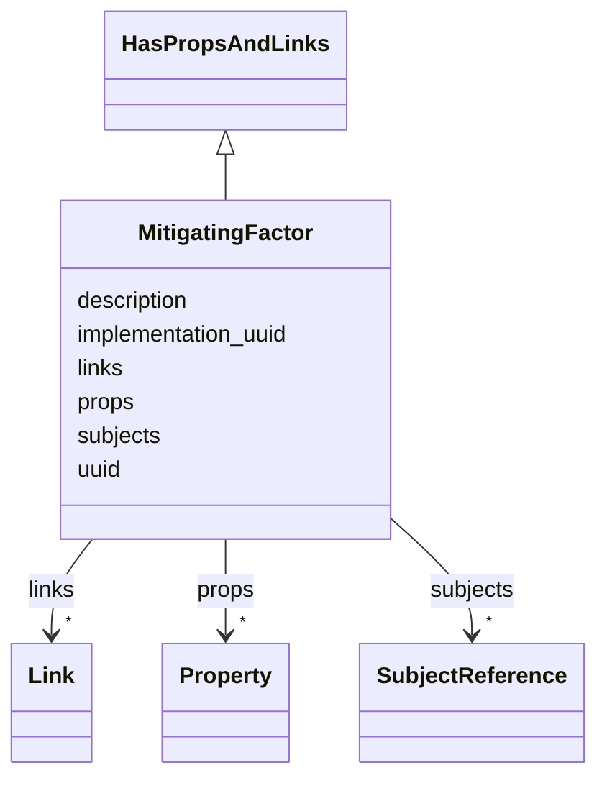

```mermaid
 classDiagram
    class MitigatingFactor
    click MitigatingFactor href "../MitigatingFactor"
      HasPropsAndLinks <|-- MitigatingFactor
        click HasPropsAndLinks href "../HasPropsAndLinks"
      
      MitigatingFactor : description
        
      MitigatingFactor : implementation_uuid
        
      MitigatingFactor : links
        
          
    
        
        
        MitigatingFactor --> "*" Link : links
        click Link href "../Link"
    

        
      MitigatingFactor : props
        
          
    
        
        
        MitigatingFactor --> "*" Property : props
        click Property href "../Property"
    

        
      MitigatingFactor : subjects
        
          
    
        
        
        MitigatingFactor --> "*" SubjectReference : subjects
        click SubjectReference href "../SubjectReference"
    

        
      MitigatingFactor : uuid
        
      
```
