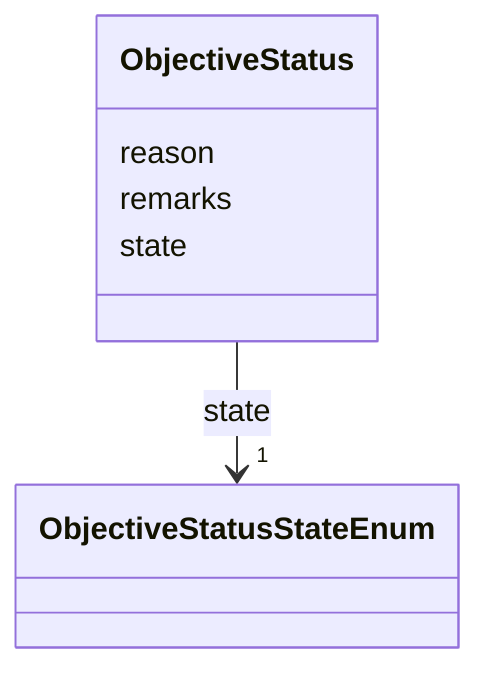

```mermaid
 classDiagram
    class ObjectiveStatus
    click ObjectiveStatus href "../ObjectiveStatus"
      ObjectiveStatus : reason
        
      ObjectiveStatus : remarks
        
      ObjectiveStatus : state
        
          
    
        
        
        ObjectiveStatus --> "1" ObjectiveStatusStateEnum : state
        click ObjectiveStatusStateEnum href "../ObjectiveStatusStateEnum"
    

        
      
```
