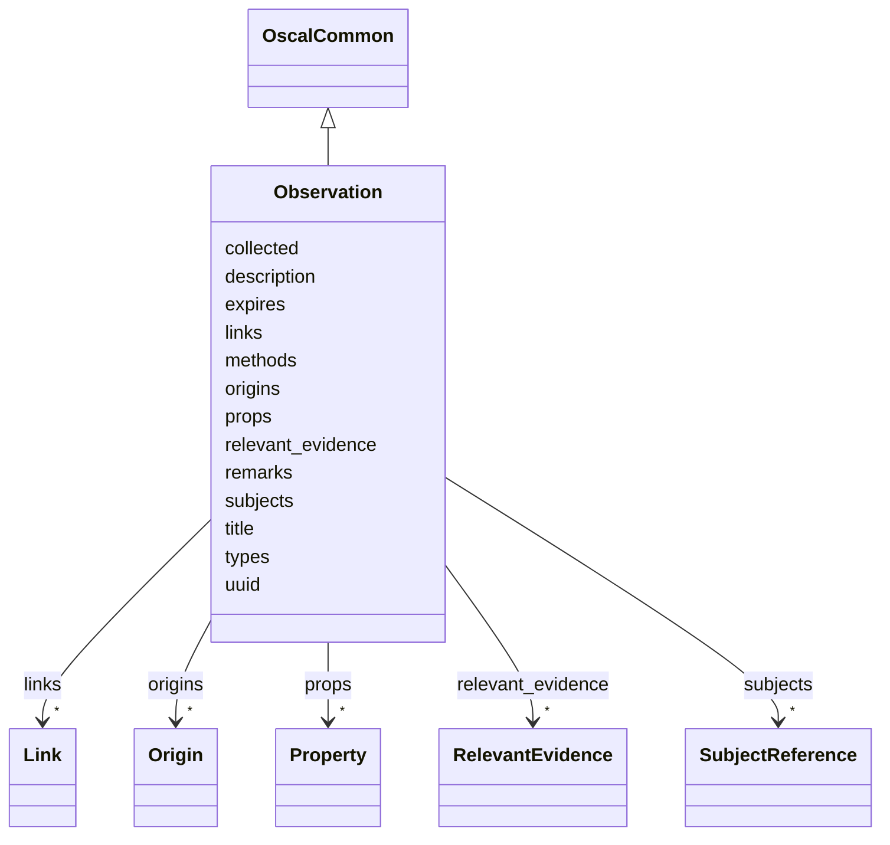

```mermaid
 classDiagram
    class Observation
    click Observation href "../Observation"
      OscalCommon <|-- Observation
        click OscalCommon href "../OscalCommon"
      
      Observation : collected
        
      Observation : description
        
      Observation : expires
        
      Observation : links
        
          
    
        
        
        Observation --> "*" Link : links
        click Link href "../Link"
    

        
      Observation : methods
        
      Observation : origins
        
          
    
        
        
        Observation --> "*" Origin : origins
        click Origin href "../Origin"
    

        
      Observation : props
        
          
    
        
        
        Observation --> "*" Property : props
        click Property href "../Property"
    

        
      Observation : relevant_evidence
        
          
    
        
        
        Observation --> "*" RelevantEvidence : relevant_evidence
        click RelevantEvidence href "../RelevantEvidence"
    

        
      Observation : remarks
        
      Observation : subjects
        
          
    
        
        
        Observation --> "*" SubjectReference : subjects
        click SubjectReference href "../SubjectReference"
    

        
      Observation : title
        
      Observation : types
        
      Observation : uuid
        
      
```
