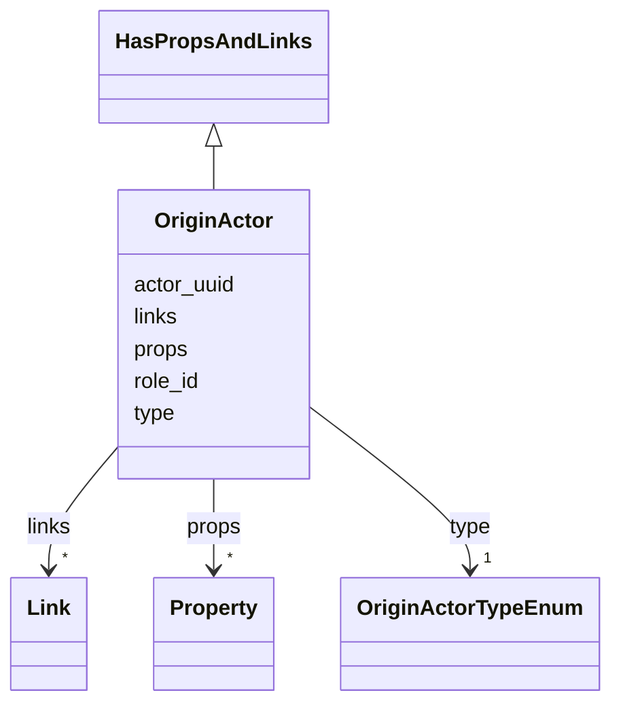

```mermaid
 classDiagram
    class OriginActor
    click OriginActor href "../OriginActor"
      HasPropsAndLinks <|-- OriginActor
        click HasPropsAndLinks href "../HasPropsAndLinks"
      
      OriginActor : actor_uuid
        
      OriginActor : links
        
          
    
        
        
        OriginActor --> "*" Link : links
        click Link href "../Link"
    

        
      OriginActor : props
        
          
    
        
        
        OriginActor --> "*" Property : props
        click Property href "../Property"
    

        
      OriginActor : role_id
        
      OriginActor : type
        
          
    
        
        
        OriginActor --> "1" OriginActorTypeEnum : type
        click OriginActorTypeEnum href "../OriginActorTypeEnum"
    

        
      
```
