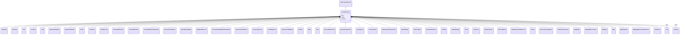

```mermaid
 classDiagram
    class OscalCommon
    click OscalCommon href "../OscalCommon"
      HasPropsAndLinks <|-- OscalCommon
        click HasPropsAndLinks href "../HasPropsAndLinks"
      

      OscalCommon <|-- Metadata
        click Metadata href "../Metadata"
      OscalCommon <|-- Revision
        click Revision href "../Revision"
      OscalCommon <|-- Role
        click Role href "../Role"
      OscalCommon <|-- Location
        click Location href "../Location"
      OscalCommon <|-- Party
        click Party href "../Party"
      OscalCommon <|-- ResponsibleParty
        click ResponsibleParty href "../ResponsibleParty"
      OscalCommon <|-- ResponsibleRole
        click ResponsibleRole href "../ResponsibleRole"
      OscalCommon <|-- Action
        click Action href "../Action"
      OscalCommon <|-- Parameter
        click Parameter href "../Parameter"
      OscalCommon <|-- ProfileGroup
        click ProfileGroup href "../ProfileGroup"
      OscalCommon <|-- ReviewedControls
        click ReviewedControls href "../ReviewedControls"
      OscalCommon <|-- ControlSelection
        click ControlSelection href "../ControlSelection"
      OscalCommon <|-- ControlObjectiveSelection
        click ControlObjectiveSelection href "../ControlObjectiveSelection"
      OscalCommon <|-- AssessmentSubject
        click AssessmentSubject href "../AssessmentSubject"
      OscalCommon <|-- SelectSubjectById
        click SelectSubjectById href "../SelectSubjectById"
      OscalCommon <|-- SubjectReference
        click SubjectReference href "../SubjectReference"
      OscalCommon <|-- AssessmentSubjectPlaceholder
        click AssessmentSubjectPlaceholder href "../AssessmentSubjectPlaceholder"
      OscalCommon <|-- AssessmentPlatform
        click AssessmentPlatform href "../AssessmentPlatform"
      OscalCommon <|-- UsesComponent
        click UsesComponent href "../UsesComponent"
      OscalCommon <|-- LocalObjective
        click LocalObjective href "../LocalObjective"
      OscalCommon <|-- AssessmentMethod
        click AssessmentMethod href "../AssessmentMethod"
      OscalCommon <|-- Activity
        click Activity href "../Activity"
      OscalCommon <|-- Step
        click Step href "../Step"
      OscalCommon <|-- Task
        click Task href "../Task"
      OscalCommon <|-- AssociatedActivity
        click AssociatedActivity href "../AssociatedActivity"
      OscalCommon <|-- SystemComponent
        click SystemComponent href "../SystemComponent"
      OscalCommon <|-- SystemUser
        click SystemUser href "../SystemUser"
      OscalCommon <|-- InventoryItem
        click InventoryItem href "../InventoryItem"
      OscalCommon <|-- ImplementedComponent
        click ImplementedComponent href "../ImplementedComponent"
      OscalCommon <|-- RelatedTask
        click RelatedTask href "../RelatedTask"
      OscalCommon <|-- Observation
        click Observation href "../Observation"
      OscalCommon <|-- RelevantEvidence
        click RelevantEvidence href "../RelevantEvidence"
      OscalCommon <|-- Finding
        click Finding href "../Finding"
      OscalCommon <|-- FindingTarget
        click FindingTarget href "../FindingTarget"
      OscalCommon <|-- Facet
        click Facet href "../Facet"
      OscalCommon <|-- Response
        click Response href "../Response"
      OscalCommon <|-- RequiredAsset
        click RequiredAsset href "../RequiredAsset"
      OscalCommon <|-- RiskLogEntry
        click RiskLogEntry href "../RiskLogEntry"
      OscalCommon <|-- RiskResponseReference
        click RiskResponseReference href "../RiskResponseReference"
      OscalCommon <|-- Result
        click Result href "../Result"
      OscalCommon <|-- AssessmentLogEntry
        click AssessmentLogEntry href "../AssessmentLogEntry"
      OscalCommon <|-- DefinedComponent
        click DefinedComponent href "../DefinedComponent"
      OscalCommon <|-- Capability
        click Capability href "../Capability"
      OscalCommon <|-- MappingProvenance
        click MappingProvenance href "../MappingProvenance"
      OscalCommon <|-- Mapping
        click Mapping href "../Mapping"
      OscalCommon <|-- Map
        click Map href "../Map"
      OscalCommon <|-- MappingItem
        click MappingItem href "../MappingItem"
      OscalCommon <|-- MappingResourceReference
        click MappingResourceReference href "../MappingResourceReference"
      OscalCommon <|-- PoamItem
        click PoamItem href "../PoamItem"
      

      OscalCommon : links
        
          
    
        
        
        OscalCommon --> "*" Link : links
        click Link href "../Link"
    

        
      OscalCommon : props
        
          
    
        
        
        OscalCommon --> "*" Property : props
        click Property href "../Property"
    

        
      OscalCommon : remarks
        
      
```
