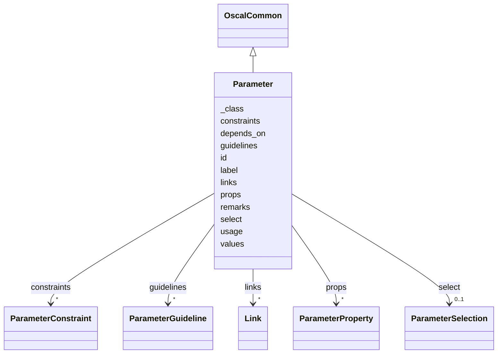

```mermaid
 classDiagram
    class Parameter
    click Parameter href "../Parameter"
      OscalCommon <|-- Parameter
        click OscalCommon href "../OscalCommon"
      
      Parameter : _class
        
      Parameter : constraints
        
          
    
        
        
        Parameter --> "*" ParameterConstraint : constraints
        click ParameterConstraint href "../ParameterConstraint"
    

        
      Parameter : depends_on
        
      Parameter : guidelines
        
          
    
        
        
        Parameter --> "*" ParameterGuideline : guidelines
        click ParameterGuideline href "../ParameterGuideline"
    

        
      Parameter : id
        
      Parameter : label
        
      Parameter : links
        
          
    
        
        
        Parameter --> "*" Link : links
        click Link href "../Link"
    

        
      Parameter : props
        
          
    
        
        
        Parameter --> "*" ParameterProperty : props
        click ParameterProperty href "../ParameterProperty"
    

        
      Parameter : remarks
        
      Parameter : select
        
          
    
        
        
        Parameter --> "0..1" ParameterSelection : select
        click ParameterSelection href "../ParameterSelection"
    

        
      Parameter : usage
        
      Parameter : values
        
      
```
