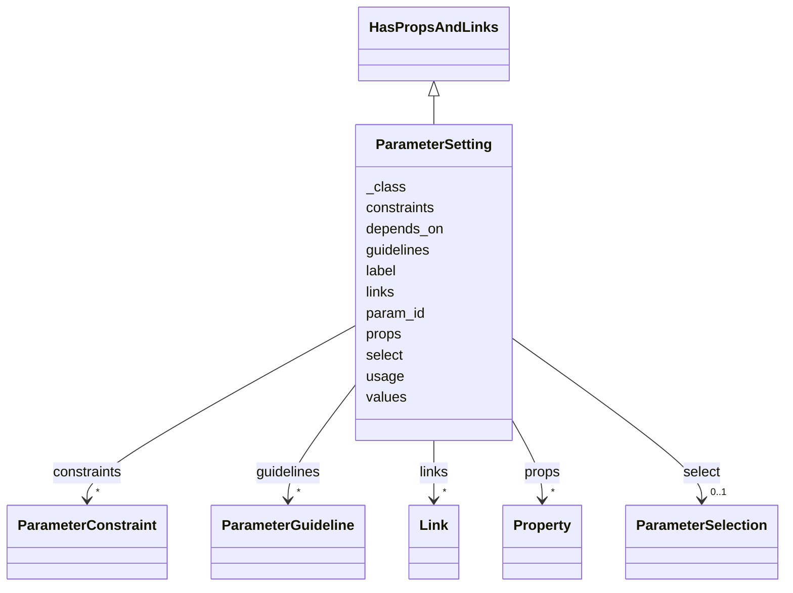

```mermaid
 classDiagram
    class ParameterSetting
    click ParameterSetting href "../ParameterSetting"
      HasPropsAndLinks <|-- ParameterSetting
        click HasPropsAndLinks href "../HasPropsAndLinks"
      
      ParameterSetting : _class
        
      ParameterSetting : constraints
        
          
    
        
        
        ParameterSetting --> "*" ParameterConstraint : constraints
        click ParameterConstraint href "../ParameterConstraint"
    

        
      ParameterSetting : depends_on
        
      ParameterSetting : guidelines
        
          
    
        
        
        ParameterSetting --> "*" ParameterGuideline : guidelines
        click ParameterGuideline href "../ParameterGuideline"
    

        
      ParameterSetting : label
        
      ParameterSetting : links
        
          
    
        
        
        ParameterSetting --> "*" Link : links
        click Link href "../Link"
    

        
      ParameterSetting : param_id
        
      ParameterSetting : props
        
          
    
        
        
        ParameterSetting --> "*" Property : props
        click Property href "../Property"
    

        
      ParameterSetting : select
        
          
    
        
        
        ParameterSetting --> "0..1" ParameterSelection : select
        click ParameterSelection href "../ParameterSelection"
    

        
      ParameterSetting : usage
        
      ParameterSetting : values
        
      
```
