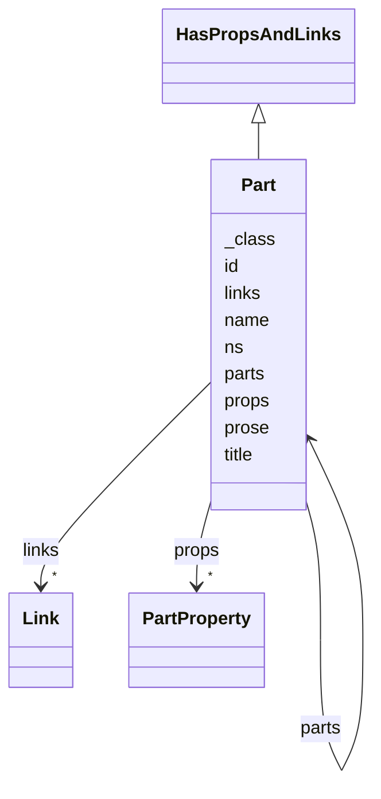

```mermaid
 classDiagram
    class Part
    click Part href "../Part"
      HasPropsAndLinks <|-- Part
        click HasPropsAndLinks href "../HasPropsAndLinks"
      
      Part : _class
        
      Part : id
        
      Part : links
        
          
    
        
        
        Part --> "*" Link : links
        click Link href "../Link"
    

        
      Part : name
        
      Part : ns
        
      Part : parts
        
          
    
        
        
        Part --> "*" Part : parts
        click Part href "../Part"
    

        
      Part : props
        
          
    
        
        
        Part --> "*" PartProperty : props
        click PartProperty href "../PartProperty"
    

        
      Part : prose
        
      Part : title
        
      
```
