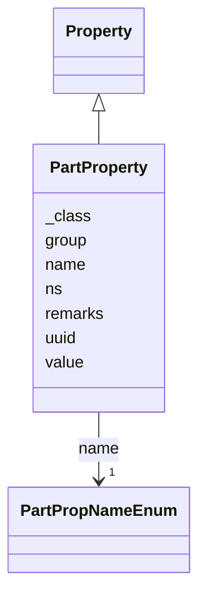

```mermaid
 classDiagram
    class PartProperty
    click PartProperty href "../PartProperty"
      Property <|-- PartProperty
        click Property href "../Property"
      
      PartProperty : _class
        
      PartProperty : group
        
      PartProperty : name
        
          
    
        
        
        PartProperty --> "1" PartPropNameEnum : name
        click PartPropNameEnum href "../PartPropNameEnum"
    

        
      PartProperty : ns
        
      PartProperty : remarks
        
      PartProperty : uuid
        
      PartProperty : value
        
      
```
