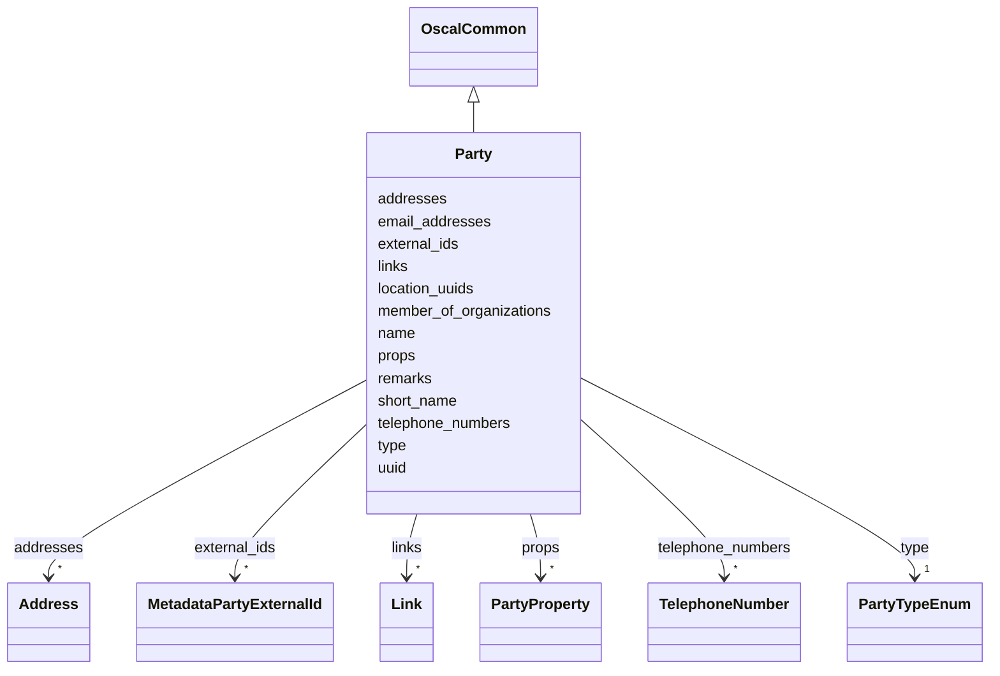

```mermaid
 classDiagram
    class Party
    click Party href "../Party"
      OscalCommon <|-- Party
        click OscalCommon href "../OscalCommon"
      
      Party : addresses
        
          
    
        
        
        Party --> "*" Address : addresses
        click Address href "../Address"
    

        
      Party : email_addresses
        
      Party : external_ids
        
          
    
        
        
        Party --> "*" MetadataPartyExternalId : external_ids
        click MetadataPartyExternalId href "../MetadataPartyExternalId"
    

        
      Party : links
        
          
    
        
        
        Party --> "*" Link : links
        click Link href "../Link"
    

        
      Party : location_uuids
        
      Party : member_of_organizations
        
      Party : name
        
      Party : props
        
          
    
        
        
        Party --> "*" PartyProperty : props
        click PartyProperty href "../PartyProperty"
    

        
      Party : remarks
        
      Party : short_name
        
      Party : telephone_numbers
        
          
    
        
        
        Party --> "*" TelephoneNumber : telephone_numbers
        click TelephoneNumber href "../TelephoneNumber"
    

        
      Party : type
        
          
    
        
        
        Party --> "1" PartyTypeEnum : type
        click PartyTypeEnum href "../PartyTypeEnum"
    

        
      Party : uuid
        
      
```
