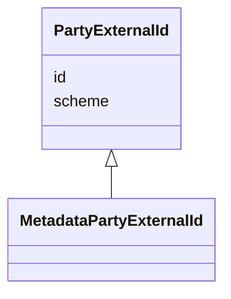

```mermaid
 classDiagram
    class PartyExternalId
    click PartyExternalId href "../PartyExternalId"
      PartyExternalId <|-- MetadataPartyExternalId
        click MetadataPartyExternalId href "../MetadataPartyExternalId"
      
      PartyExternalId : id
        
      PartyExternalId : scheme
        
      
```
