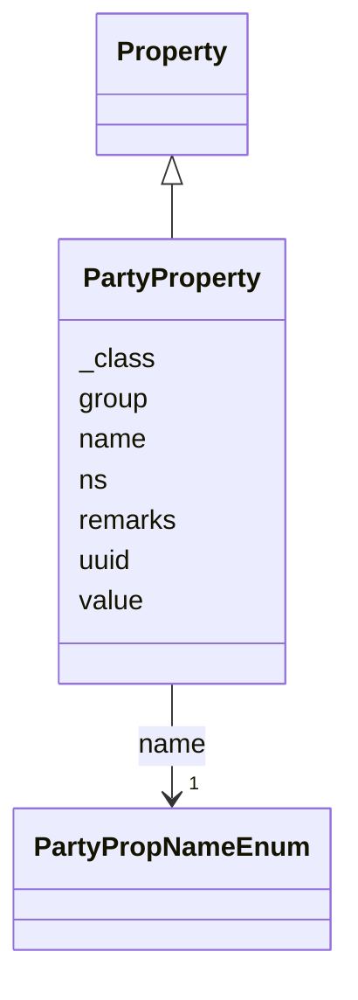

```mermaid
 classDiagram
    class PartyProperty
    click PartyProperty href "../PartyProperty"
      Property <|-- PartyProperty
        click Property href "../Property"
      
      PartyProperty : _class
        
      PartyProperty : group
        
      PartyProperty : name
        
          
    
        
        
        PartyProperty --> "1" PartyPropNameEnum : name
        click PartyPropNameEnum href "../PartyPropNameEnum"
    

        
      PartyProperty : ns
        
      PartyProperty : remarks
        
      PartyProperty : uuid
        
      PartyProperty : value
        
      
```
