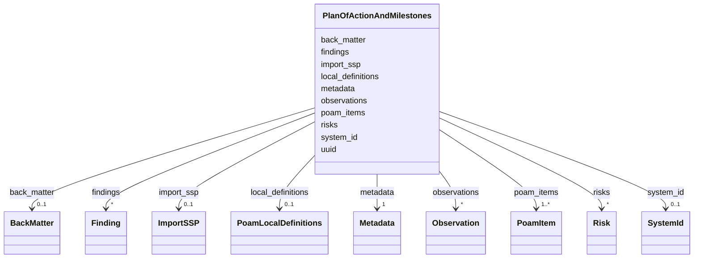

```mermaid
 classDiagram
    class PlanOfActionAndMilestones
    click PlanOfActionAndMilestones href "../PlanOfActionAndMilestones"
      PlanOfActionAndMilestones : back_matter
        
          
    
        
        
        PlanOfActionAndMilestones --> "0..1" BackMatter : back_matter
        click BackMatter href "../BackMatter"
    

        
      PlanOfActionAndMilestones : findings
        
          
    
        
        
        PlanOfActionAndMilestones --> "*" Finding : findings
        click Finding href "../Finding"
    

        
      PlanOfActionAndMilestones : import_ssp
        
          
    
        
        
        PlanOfActionAndMilestones --> "0..1" ImportSSP : import_ssp
        click ImportSSP href "../ImportSSP"
    

        
      PlanOfActionAndMilestones : local_definitions
        
          
    
        
        
        PlanOfActionAndMilestones --> "0..1" PoamLocalDefinitions : local_definitions
        click PoamLocalDefinitions href "../PoamLocalDefinitions"
    

        
      PlanOfActionAndMilestones : metadata
        
          
    
        
        
        PlanOfActionAndMilestones --> "1" Metadata : metadata
        click Metadata href "../Metadata"
    

        
      PlanOfActionAndMilestones : observations
        
          
    
        
        
        PlanOfActionAndMilestones --> "*" Observation : observations
        click Observation href "../Observation"
    

        
      PlanOfActionAndMilestones : poam_items
        
          
    
        
        
        PlanOfActionAndMilestones --> "1..*" PoamItem : poam_items
        click PoamItem href "../PoamItem"
    

        
      PlanOfActionAndMilestones : risks
        
          
    
        
        
        PlanOfActionAndMilestones --> "*" Risk : risks
        click Risk href "../Risk"
    

        
      PlanOfActionAndMilestones : system_id
        
          
    
        
        
        PlanOfActionAndMilestones --> "0..1" SystemId : system_id
        click SystemId href "../SystemId"
    

        
      PlanOfActionAndMilestones : uuid
        
      
```
