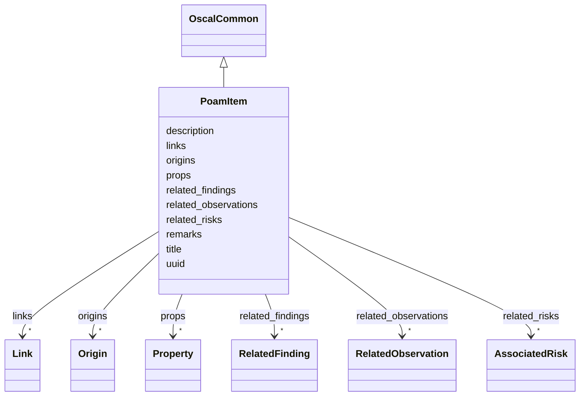

```mermaid
 classDiagram
    class PoamItem
    click PoamItem href "../PoamItem"
      OscalCommon <|-- PoamItem
        click OscalCommon href "../OscalCommon"
      
      PoamItem : description
        
      PoamItem : links
        
          
    
        
        
        PoamItem --> "*" Link : links
        click Link href "../Link"
    

        
      PoamItem : origins
        
          
    
        
        
        PoamItem --> "*" Origin : origins
        click Origin href "../Origin"
    

        
      PoamItem : props
        
          
    
        
        
        PoamItem --> "*" Property : props
        click Property href "../Property"
    

        
      PoamItem : related_findings
        
          
    
        
        
        PoamItem --> "*" RelatedFinding : related_findings
        click RelatedFinding href "../RelatedFinding"
    

        
      PoamItem : related_observations
        
          
    
        
        
        PoamItem --> "*" RelatedObservation : related_observations
        click RelatedObservation href "../RelatedObservation"
    

        
      PoamItem : related_risks
        
          
    
        
        
        PoamItem --> "*" AssociatedRisk : related_risks
        click AssociatedRisk href "../AssociatedRisk"
    

        
      PoamItem : remarks
        
      PoamItem : title
        
      PoamItem : uuid
        
      
```
