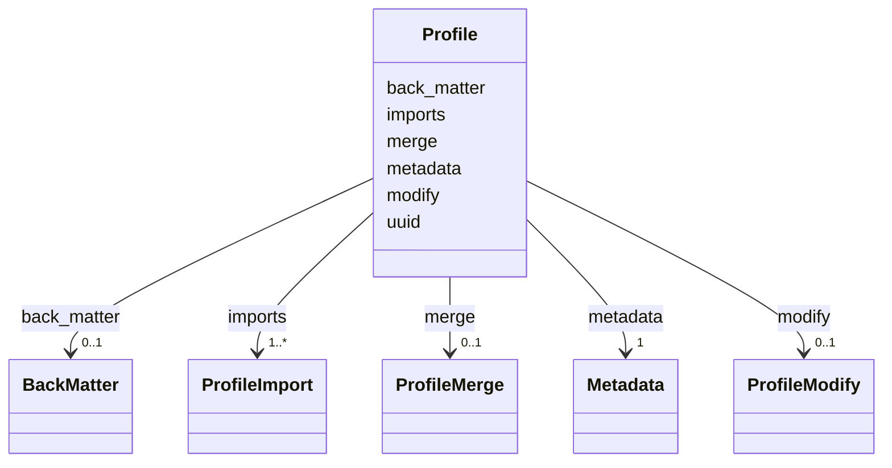

```mermaid
 classDiagram
    class Profile
    click Profile href "../Profile"
      Profile : back_matter
        
          
    
        
        
        Profile --> "0..1" BackMatter : back_matter
        click BackMatter href "../BackMatter"
    

        
      Profile : imports
        
          
    
        
        
        Profile --> "1..*" ProfileImport : imports
        click ProfileImport href "../ProfileImport"
    

        
      Profile : merge
        
          
    
        
        
        Profile --> "0..1" ProfileMerge : merge
        click ProfileMerge href "../ProfileMerge"
    

        
      Profile : metadata
        
          
    
        
        
        Profile --> "1" Metadata : metadata
        click Metadata href "../Metadata"
    

        
      Profile : modify
        
          
    
        
        
        Profile --> "0..1" ProfileModify : modify
        click ProfileModify href "../ProfileModify"
    

        
      Profile : uuid
        
      
```
