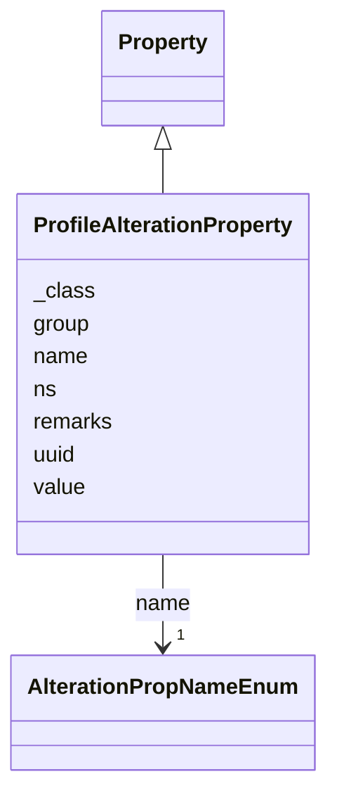

```mermaid
 classDiagram
    class ProfileAlterationProperty
    click ProfileAlterationProperty href "../ProfileAlterationProperty"
      Property <|-- ProfileAlterationProperty
        click Property href "../Property"
      
      ProfileAlterationProperty : _class
        
      ProfileAlterationProperty : group
        
      ProfileAlterationProperty : name
        
          
    
        
        
        ProfileAlterationProperty --> "1" AlterationPropNameEnum : name
        click AlterationPropNameEnum href "../AlterationPropNameEnum"
    

        
      ProfileAlterationProperty : ns
        
      ProfileAlterationProperty : remarks
        
      ProfileAlterationProperty : uuid
        
      ProfileAlterationProperty : value
        
      
```
