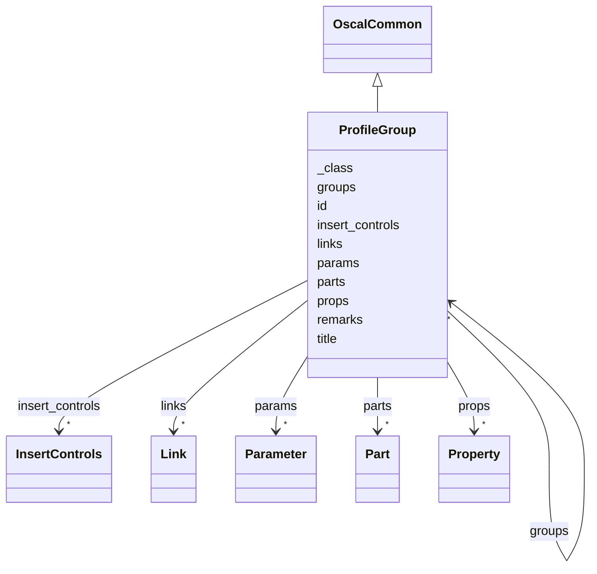

```mermaid
 classDiagram
    class ProfileGroup
    click ProfileGroup href "../ProfileGroup"
      OscalCommon <|-- ProfileGroup
        click OscalCommon href "../OscalCommon"
      
      ProfileGroup : _class
        
      ProfileGroup : groups
        
          
    
        
        
        ProfileGroup --> "*" ProfileGroup : groups
        click ProfileGroup href "../ProfileGroup"
    

        
      ProfileGroup : id
        
      ProfileGroup : insert_controls
        
          
    
        
        
        ProfileGroup --> "*" InsertControls : insert_controls
        click InsertControls href "../InsertControls"
    

        
      ProfileGroup : links
        
          
    
        
        
        ProfileGroup --> "*" Link : links
        click Link href "../Link"
    

        
      ProfileGroup : params
        
          
    
        
        
        ProfileGroup --> "*" Parameter : params
        click Parameter href "../Parameter"
    

        
      ProfileGroup : parts
        
          
    
        
        
        ProfileGroup --> "*" Part : parts
        click Part href "../Part"
    

        
      ProfileGroup : props
        
          
    
        
        
        ProfileGroup --> "*" Property : props
        click Property href "../Property"
    

        
      ProfileGroup : remarks
        
      ProfileGroup : title
        
      
```
