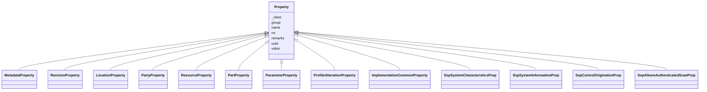

```mermaid
 classDiagram
    class Property
    click Property href "../Property"
      Property <|-- MetadataProperty
        click MetadataProperty href "../MetadataProperty"
      Property <|-- RevisionProperty
        click RevisionProperty href "../RevisionProperty"
      Property <|-- LocationProperty
        click LocationProperty href "../LocationProperty"
      Property <|-- PartyProperty
        click PartyProperty href "../PartyProperty"
      Property <|-- ResourceProperty
        click ResourceProperty href "../ResourceProperty"
      Property <|-- PartProperty
        click PartProperty href "../PartProperty"
      Property <|-- ParameterProperty
        click ParameterProperty href "../ParameterProperty"
      Property <|-- ProfileAlterationProperty
        click ProfileAlterationProperty href "../ProfileAlterationProperty"
      Property <|-- ImplementationCommonProperty
        click ImplementationCommonProperty href "../ImplementationCommonProperty"
      Property <|-- SspSystemCharacteristicsProp
        click SspSystemCharacteristicsProp href "../SspSystemCharacteristicsProp"
      Property <|-- SspSystemInformationProp
        click SspSystemInformationProp href "../SspSystemInformationProp"
      Property <|-- SspControlOriginationProp
        click SspControlOriginationProp href "../SspControlOriginationProp"
      Property <|-- SspAllowsAuthenticatedScanProp
        click SspAllowsAuthenticatedScanProp href "../SspAllowsAuthenticatedScanProp"
      
      Property : _class
        
      Property : group
        
      Property : name
        
      Property : ns
        
      Property : remarks
        
      Property : uuid
        
      Property : value
        
      
```
