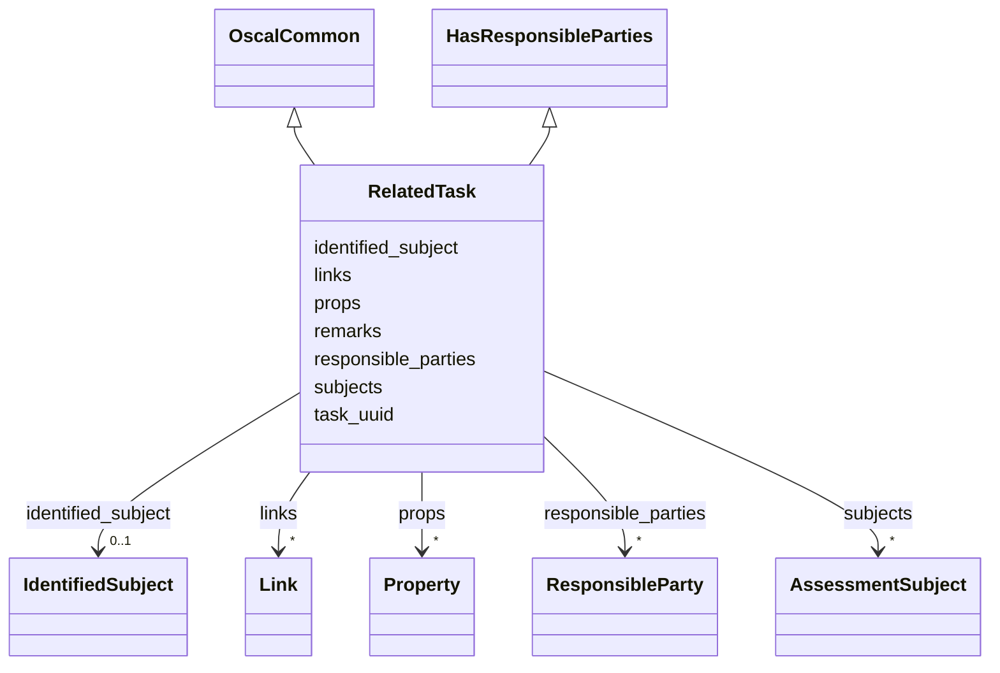

```mermaid
 classDiagram
    class RelatedTask
    click RelatedTask href "../RelatedTask"
      OscalCommon <|-- RelatedTask
        click OscalCommon href "../OscalCommon"
      HasResponsibleParties <|-- RelatedTask
        click HasResponsibleParties href "../HasResponsibleParties"
      
      RelatedTask : identified_subject
        
          
    
        
        
        RelatedTask --> "0..1" IdentifiedSubject : identified_subject
        click IdentifiedSubject href "../IdentifiedSubject"
    

        
      RelatedTask : links
        
          
    
        
        
        RelatedTask --> "*" Link : links
        click Link href "../Link"
    

        
      RelatedTask : props
        
          
    
        
        
        RelatedTask --> "*" Property : props
        click Property href "../Property"
    

        
      RelatedTask : remarks
        
      RelatedTask : responsible_parties
        
          
    
        
        
        RelatedTask --> "*" ResponsibleParty : responsible_parties
        click ResponsibleParty href "../ResponsibleParty"
    

        
      RelatedTask : subjects
        
          
    
        
        
        RelatedTask --> "*" AssessmentSubject : subjects
        click AssessmentSubject href "../AssessmentSubject"
    

        
      RelatedTask : task_uuid
        
      
```
