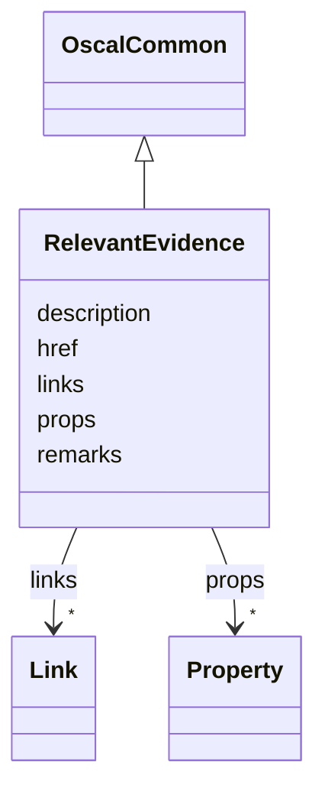

```mermaid
 classDiagram
    class RelevantEvidence
    click RelevantEvidence href "../RelevantEvidence"
      OscalCommon <|-- RelevantEvidence
        click OscalCommon href "../OscalCommon"
      
      RelevantEvidence : description
        
      RelevantEvidence : href
        
      RelevantEvidence : links
        
          
    
        
        
        RelevantEvidence --> "*" Link : links
        click Link href "../Link"
    

        
      RelevantEvidence : props
        
          
    
        
        
        RelevantEvidence --> "*" Property : props
        click Property href "../Property"
    

        
      RelevantEvidence : remarks
        
      
```
