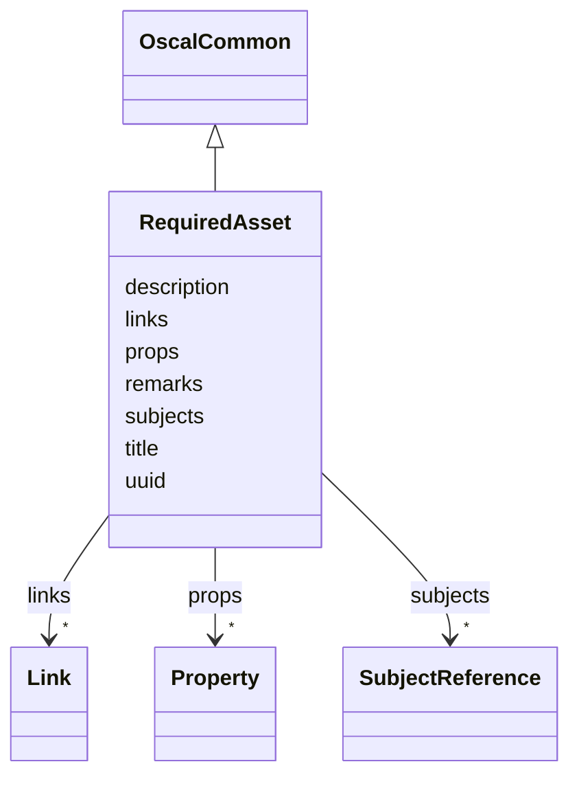

```mermaid
 classDiagram
    class RequiredAsset
    click RequiredAsset href "../RequiredAsset"
      OscalCommon <|-- RequiredAsset
        click OscalCommon href "../OscalCommon"
      
      RequiredAsset : description
        
      RequiredAsset : links
        
          
    
        
        
        RequiredAsset --> "*" Link : links
        click Link href "../Link"
    

        
      RequiredAsset : props
        
          
    
        
        
        RequiredAsset --> "*" Property : props
        click Property href "../Property"
    

        
      RequiredAsset : remarks
        
      RequiredAsset : subjects
        
          
    
        
        
        RequiredAsset --> "*" SubjectReference : subjects
        click SubjectReference href "../SubjectReference"
    

        
      RequiredAsset : title
        
      RequiredAsset : uuid
        
      
```
