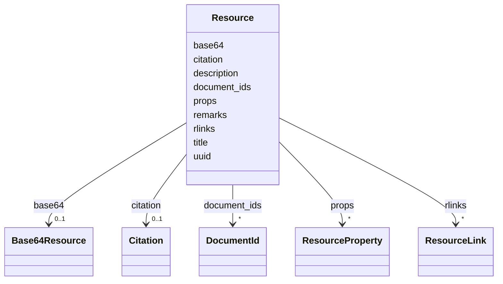

```mermaid
 classDiagram
    class Resource
    click Resource href "../Resource"
      Resource : base64
        
          
    
        
        
        Resource --> "0..1" Base64Resource : base64
        click Base64Resource href "../Base64Resource"
    

        
      Resource : citation
        
          
    
        
        
        Resource --> "0..1" Citation : citation
        click Citation href "../Citation"
    

        
      Resource : description
        
      Resource : document_ids
        
          
    
        
        
        Resource --> "*" DocumentId : document_ids
        click DocumentId href "../DocumentId"
    

        
      Resource : props
        
          
    
        
        
        Resource --> "*" ResourceProperty : props
        click ResourceProperty href "../ResourceProperty"
    

        
      Resource : remarks
        
      Resource : rlinks
        
          
    
        
        
        Resource --> "*" ResourceLink : rlinks
        click ResourceLink href "../ResourceLink"
    

        
      Resource : title
        
      Resource : uuid
        
      
```
