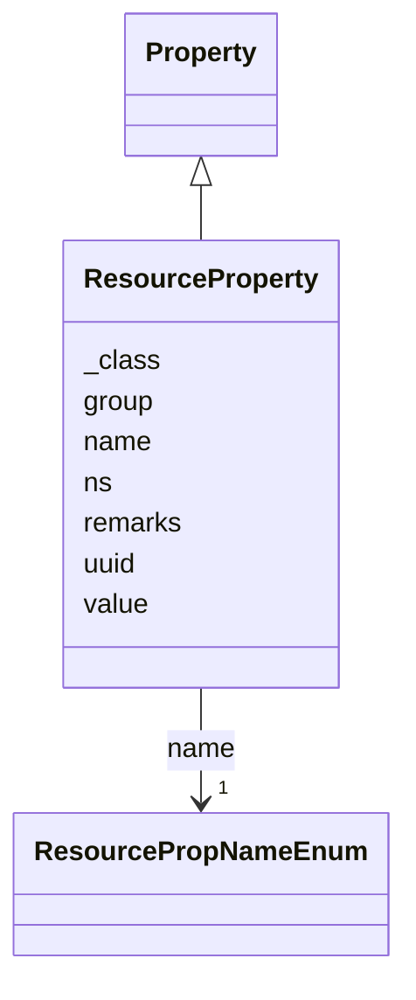

```mermaid
 classDiagram
    class ResourceProperty
    click ResourceProperty href "../ResourceProperty"
      Property <|-- ResourceProperty
        click Property href "../Property"
      
      ResourceProperty : _class
        
      ResourceProperty : group
        
      ResourceProperty : name
        
          
    
        
        
        ResourceProperty --> "1" ResourcePropNameEnum : name
        click ResourcePropNameEnum href "../ResourcePropNameEnum"
    

        
      ResourceProperty : ns
        
      ResourceProperty : remarks
        
      ResourceProperty : uuid
        
      ResourceProperty : value
        
      
```
