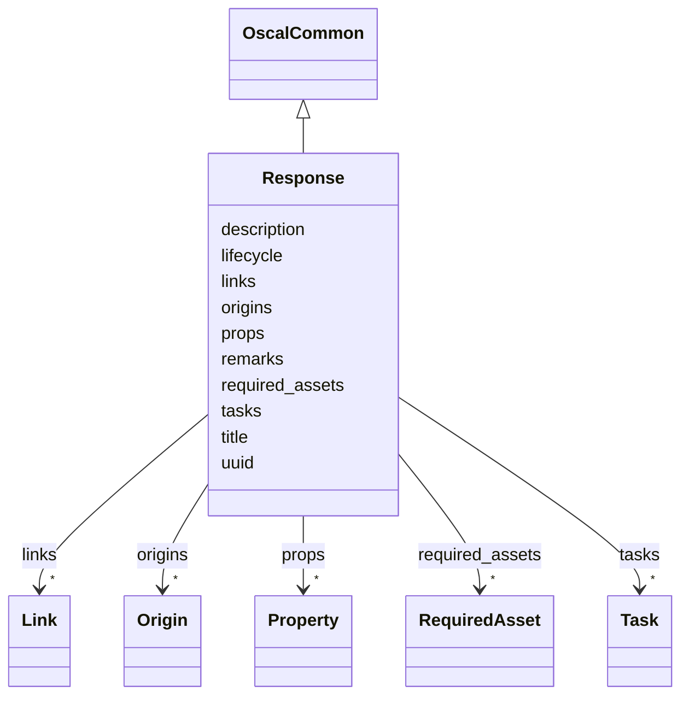

```mermaid
 classDiagram
    class Response
    click Response href "../Response"
      OscalCommon <|-- Response
        click OscalCommon href "../OscalCommon"
      
      Response : description
        
      Response : lifecycle
        
      Response : links
        
          
    
        
        
        Response --> "*" Link : links
        click Link href "../Link"
    

        
      Response : origins
        
          
    
        
        
        Response --> "*" Origin : origins
        click Origin href "../Origin"
    

        
      Response : props
        
          
    
        
        
        Response --> "*" Property : props
        click Property href "../Property"
    

        
      Response : remarks
        
      Response : required_assets
        
          
    
        
        
        Response --> "*" RequiredAsset : required_assets
        click RequiredAsset href "../RequiredAsset"
    

        
      Response : tasks
        
          
    
        
        
        Response --> "*" Task : tasks
        click Task href "../Task"
    

        
      Response : title
        
      Response : uuid
        
      
```
