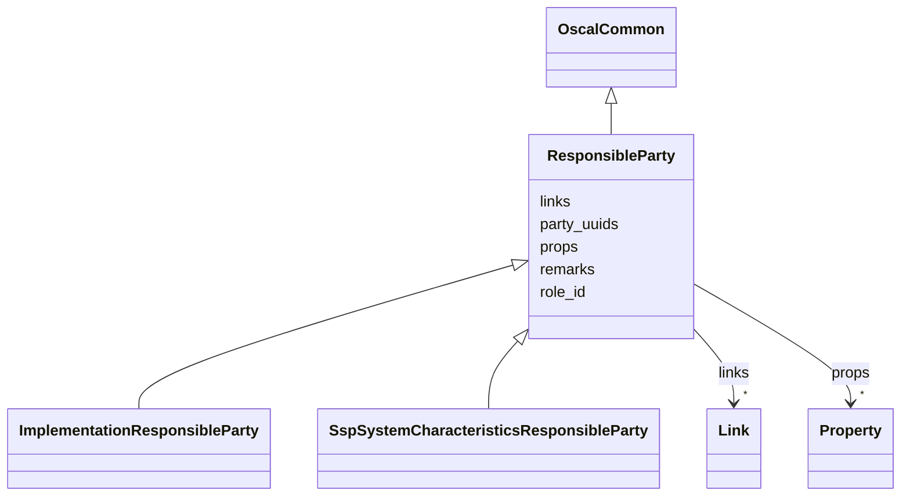

```mermaid
 classDiagram
    class ResponsibleParty
    click ResponsibleParty href "../ResponsibleParty"
      OscalCommon <|-- ResponsibleParty
        click OscalCommon href "../OscalCommon"
      

      ResponsibleParty <|-- ImplementationResponsibleParty
        click ImplementationResponsibleParty href "../ImplementationResponsibleParty"
      ResponsibleParty <|-- SspSystemCharacteristicsResponsibleParty
        click SspSystemCharacteristicsResponsibleParty href "../SspSystemCharacteristicsResponsibleParty"
      

      ResponsibleParty : links
        
          
    
        
        
        ResponsibleParty --> "*" Link : links
        click Link href "../Link"
    

        
      ResponsibleParty : party_uuids
        
      ResponsibleParty : props
        
          
    
        
        
        ResponsibleParty --> "*" Property : props
        click Property href "../Property"
    

        
      ResponsibleParty : remarks
        
      ResponsibleParty : role_id
        
      
```
