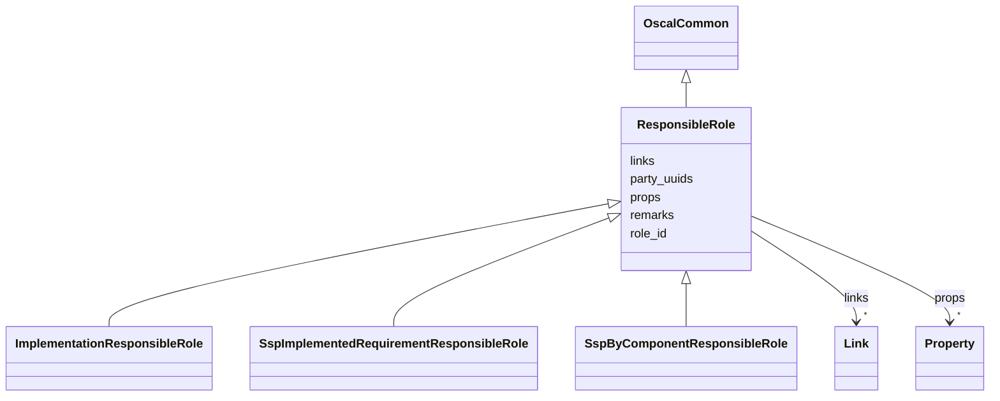

```mermaid
 classDiagram
    class ResponsibleRole
    click ResponsibleRole href "../ResponsibleRole"
      OscalCommon <|-- ResponsibleRole
        click OscalCommon href "../OscalCommon"
      

      ResponsibleRole <|-- ImplementationResponsibleRole
        click ImplementationResponsibleRole href "../ImplementationResponsibleRole"
      ResponsibleRole <|-- SspImplementedRequirementResponsibleRole
        click SspImplementedRequirementResponsibleRole href "../SspImplementedRequirementResponsibleRole"
      ResponsibleRole <|-- SspByComponentResponsibleRole
        click SspByComponentResponsibleRole href "../SspByComponentResponsibleRole"
      

      ResponsibleRole : links
        
          
    
        
        
        ResponsibleRole --> "*" Link : links
        click Link href "../Link"
    

        
      ResponsibleRole : party_uuids
        
      ResponsibleRole : props
        
          
    
        
        
        ResponsibleRole --> "*" Property : props
        click Property href "../Property"
    

        
      ResponsibleRole : remarks
        
      ResponsibleRole : role_id
        
      
```
