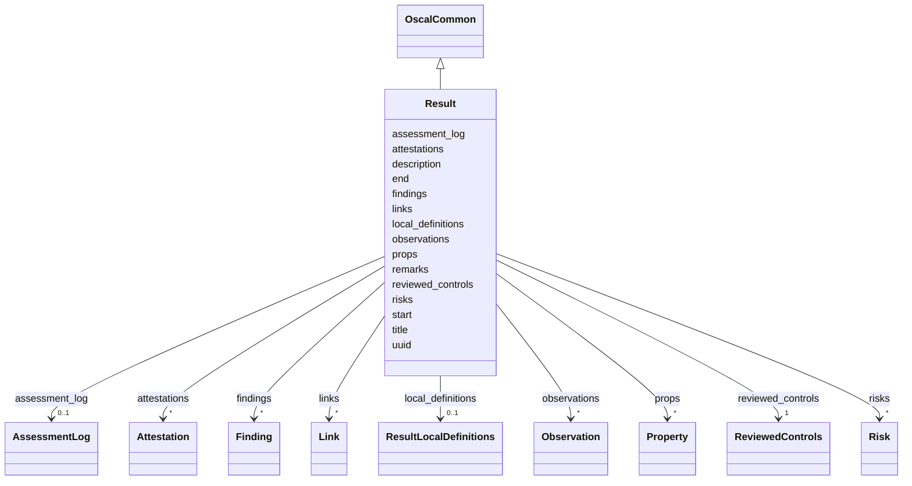

```mermaid
 classDiagram
    class Result
    click Result href "../Result"
      OscalCommon <|-- Result
        click OscalCommon href "../OscalCommon"
      
      Result : assessment_log
        
          
    
        
        
        Result --> "0..1" AssessmentLog : assessment_log
        click AssessmentLog href "../AssessmentLog"
    

        
      Result : attestations
        
          
    
        
        
        Result --> "*" Attestation : attestations
        click Attestation href "../Attestation"
    

        
      Result : description
        
      Result : end
        
      Result : findings
        
          
    
        
        
        Result --> "*" Finding : findings
        click Finding href "../Finding"
    

        
      Result : links
        
          
    
        
        
        Result --> "*" Link : links
        click Link href "../Link"
    

        
      Result : local_definitions
        
          
    
        
        
        Result --> "0..1" ResultLocalDefinitions : local_definitions
        click ResultLocalDefinitions href "../ResultLocalDefinitions"
    

        
      Result : observations
        
          
    
        
        
        Result --> "*" Observation : observations
        click Observation href "../Observation"
    

        
      Result : props
        
          
    
        
        
        Result --> "*" Property : props
        click Property href "../Property"
    

        
      Result : remarks
        
      Result : reviewed_controls
        
          
    
        
        
        Result --> "1" ReviewedControls : reviewed_controls
        click ReviewedControls href "../ReviewedControls"
    

        
      Result : risks
        
          
    
        
        
        Result --> "*" Risk : risks
        click Risk href "../Risk"
    

        
      Result : start
        
      Result : title
        
      Result : uuid
        
      
```
