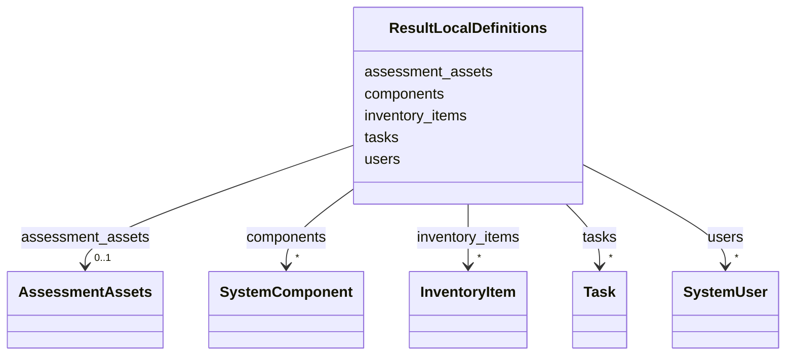

```mermaid
 classDiagram
    class ResultLocalDefinitions
    click ResultLocalDefinitions href "../ResultLocalDefinitions"
      ResultLocalDefinitions : assessment_assets
        
          
    
        
        
        ResultLocalDefinitions --> "0..1" AssessmentAssets : assessment_assets
        click AssessmentAssets href "../AssessmentAssets"
    

        
      ResultLocalDefinitions : components
        
          
    
        
        
        ResultLocalDefinitions --> "*" SystemComponent : components
        click SystemComponent href "../SystemComponent"
    

        
      ResultLocalDefinitions : inventory_items
        
          
    
        
        
        ResultLocalDefinitions --> "*" InventoryItem : inventory_items
        click InventoryItem href "../InventoryItem"
    

        
      ResultLocalDefinitions : tasks
        
          
    
        
        
        ResultLocalDefinitions --> "*" Task : tasks
        click Task href "../Task"
    

        
      ResultLocalDefinitions : users
        
          
    
        
        
        ResultLocalDefinitions --> "*" SystemUser : users
        click SystemUser href "../SystemUser"
    

        
      
```
