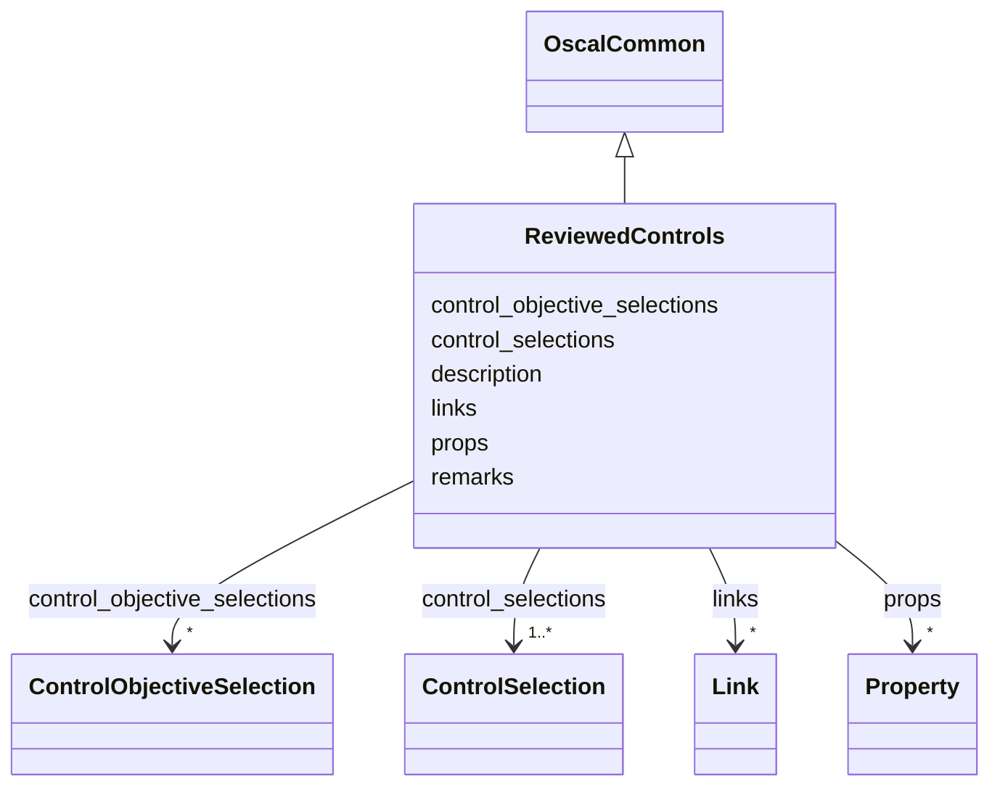

```mermaid
 classDiagram
    class ReviewedControls
    click ReviewedControls href "../ReviewedControls"
      OscalCommon <|-- ReviewedControls
        click OscalCommon href "../OscalCommon"
      
      ReviewedControls : control_objective_selections
        
          
    
        
        
        ReviewedControls --> "*" ControlObjectiveSelection : control_objective_selections
        click ControlObjectiveSelection href "../ControlObjectiveSelection"
    

        
      ReviewedControls : control_selections
        
          
    
        
        
        ReviewedControls --> "1..*" ControlSelection : control_selections
        click ControlSelection href "../ControlSelection"
    

        
      ReviewedControls : description
        
      ReviewedControls : links
        
          
    
        
        
        ReviewedControls --> "*" Link : links
        click Link href "../Link"
    

        
      ReviewedControls : props
        
          
    
        
        
        ReviewedControls --> "*" Property : props
        click Property href "../Property"
    

        
      ReviewedControls : remarks
        
      
```
