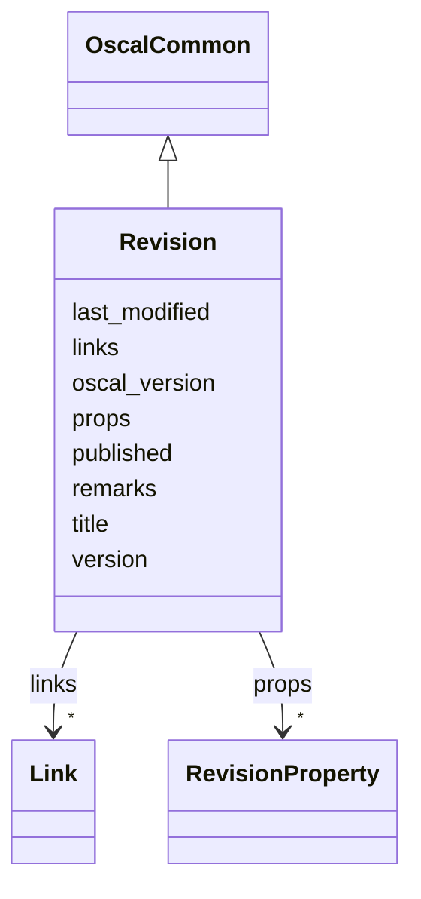

```mermaid
 classDiagram
    class Revision
    click Revision href "../Revision"
      OscalCommon <|-- Revision
        click OscalCommon href "../OscalCommon"
      
      Revision : last_modified
        
      Revision : links
        
          
    
        
        
        Revision --> "*" Link : links
        click Link href "../Link"
    

        
      Revision : oscal_version
        
      Revision : props
        
          
    
        
        
        Revision --> "*" RevisionProperty : props
        click RevisionProperty href "../RevisionProperty"
    

        
      Revision : published
        
      Revision : remarks
        
      Revision : title
        
      Revision : version
        
      
```
