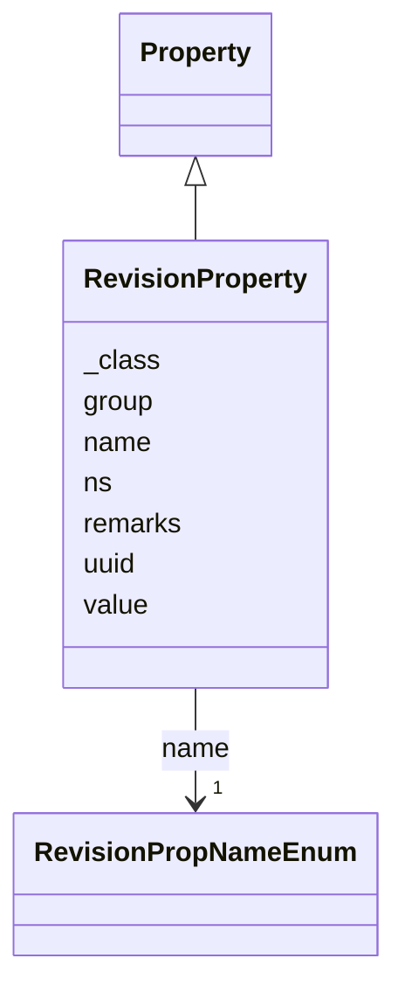

```mermaid
 classDiagram
    class RevisionProperty
    click RevisionProperty href "../RevisionProperty"
      Property <|-- RevisionProperty
        click Property href "../Property"
      
      RevisionProperty : _class
        
      RevisionProperty : group
        
      RevisionProperty : name
        
          
    
        
        
        RevisionProperty --> "1" RevisionPropNameEnum : name
        click RevisionPropNameEnum href "../RevisionPropNameEnum"
    

        
      RevisionProperty : ns
        
      RevisionProperty : remarks
        
      RevisionProperty : uuid
        
      RevisionProperty : value
        
      
```
