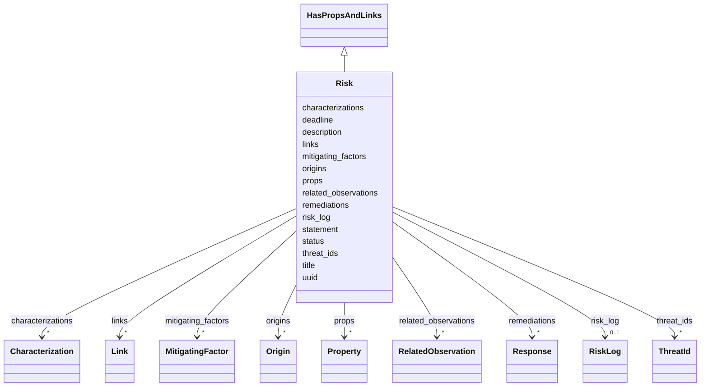

```mermaid
 classDiagram
    class Risk
    click Risk href "../Risk"
      HasPropsAndLinks <|-- Risk
        click HasPropsAndLinks href "../HasPropsAndLinks"
      
      Risk : characterizations
        
          
    
        
        
        Risk --> "*" Characterization : characterizations
        click Characterization href "../Characterization"
    

        
      Risk : deadline
        
      Risk : description
        
      Risk : links
        
          
    
        
        
        Risk --> "*" Link : links
        click Link href "../Link"
    

        
      Risk : mitigating_factors
        
          
    
        
        
        Risk --> "*" MitigatingFactor : mitigating_factors
        click MitigatingFactor href "../MitigatingFactor"
    

        
      Risk : origins
        
          
    
        
        
        Risk --> "*" Origin : origins
        click Origin href "../Origin"
    

        
      Risk : props
        
          
    
        
        
        Risk --> "*" Property : props
        click Property href "../Property"
    

        
      Risk : related_observations
        
          
    
        
        
        Risk --> "*" RelatedObservation : related_observations
        click RelatedObservation href "../RelatedObservation"
    

        
      Risk : remediations
        
          
    
        
        
        Risk --> "*" Response : remediations
        click Response href "../Response"
    

        
      Risk : risk_log
        
          
    
        
        
        Risk --> "0..1" RiskLog : risk_log
        click RiskLog href "../RiskLog"
    

        
      Risk : statement
        
      Risk : status
        
      Risk : threat_ids
        
          
    
        
        
        Risk --> "*" ThreatId : threat_ids
        click ThreatId href "../ThreatId"
    

        
      Risk : title
        
      Risk : uuid
        
      
```
