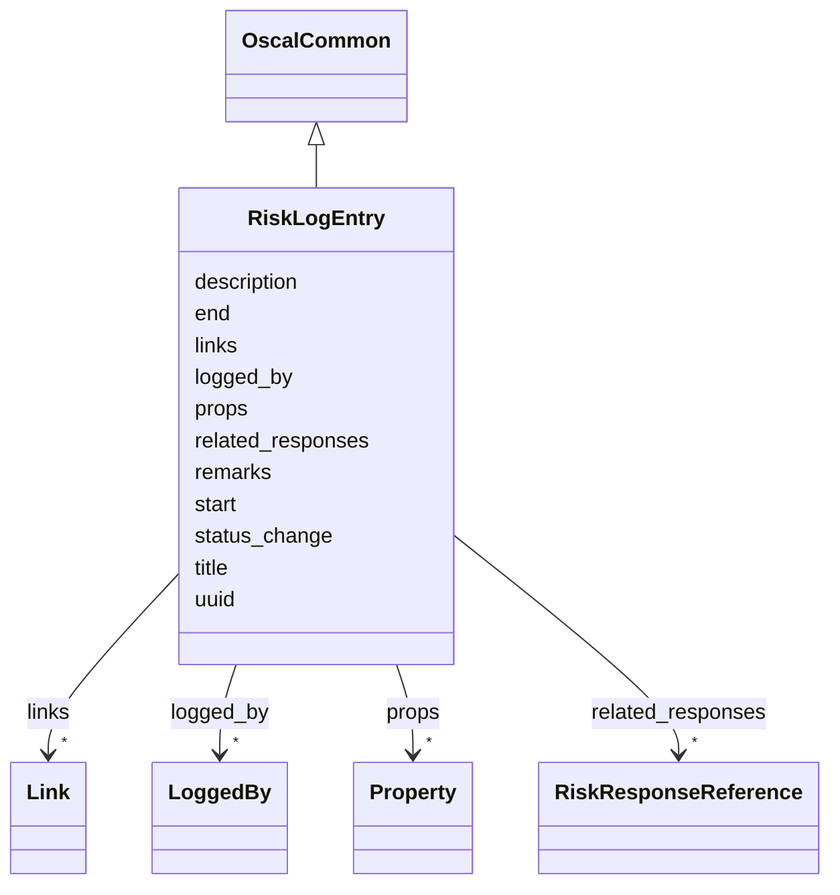

```mermaid
 classDiagram
    class RiskLogEntry
    click RiskLogEntry href "../RiskLogEntry"
      OscalCommon <|-- RiskLogEntry
        click OscalCommon href "../OscalCommon"
      
      RiskLogEntry : description
        
      RiskLogEntry : end
        
      RiskLogEntry : links
        
          
    
        
        
        RiskLogEntry --> "*" Link : links
        click Link href "../Link"
    

        
      RiskLogEntry : logged_by
        
          
    
        
        
        RiskLogEntry --> "*" LoggedBy : logged_by
        click LoggedBy href "../LoggedBy"
    

        
      RiskLogEntry : props
        
          
    
        
        
        RiskLogEntry --> "*" Property : props
        click Property href "../Property"
    

        
      RiskLogEntry : related_responses
        
          
    
        
        
        RiskLogEntry --> "*" RiskResponseReference : related_responses
        click RiskResponseReference href "../RiskResponseReference"
    

        
      RiskLogEntry : remarks
        
      RiskLogEntry : start
        
      RiskLogEntry : status_change
        
      RiskLogEntry : title
        
      RiskLogEntry : uuid
        
      
```
