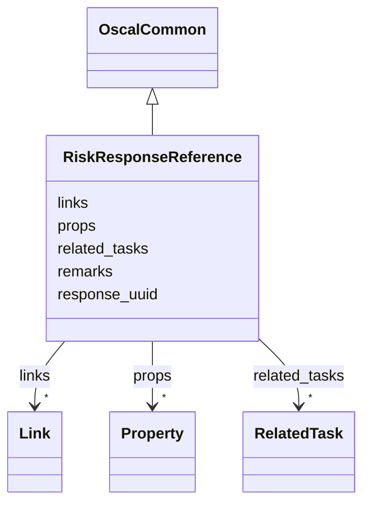

```mermaid
 classDiagram
    class RiskResponseReference
    click RiskResponseReference href "../RiskResponseReference"
      OscalCommon <|-- RiskResponseReference
        click OscalCommon href "../OscalCommon"
      
      RiskResponseReference : links
        
          
    
        
        
        RiskResponseReference --> "*" Link : links
        click Link href "../Link"
    

        
      RiskResponseReference : props
        
          
    
        
        
        RiskResponseReference --> "*" Property : props
        click Property href "../Property"
    

        
      RiskResponseReference : related_tasks
        
          
    
        
        
        RiskResponseReference --> "*" RelatedTask : related_tasks
        click RelatedTask href "../RelatedTask"
    

        
      RiskResponseReference : remarks
        
      RiskResponseReference : response_uuid
        
      
```
