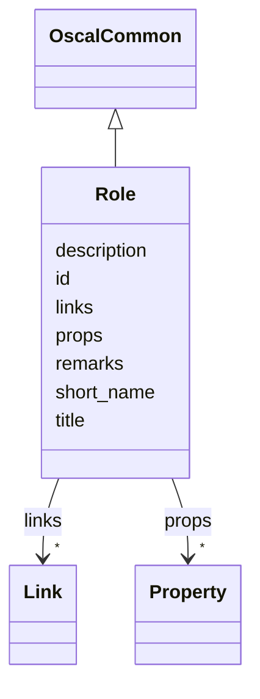

```mermaid
 classDiagram
    class Role
    click Role href "../Role"
      OscalCommon <|-- Role
        click OscalCommon href "../OscalCommon"
      
      Role : description
        
      Role : id
        
      Role : links
        
          
    
        
        
        Role --> "*" Link : links
        click Link href "../Link"
    

        
      Role : props
        
          
    
        
        
        Role --> "*" Property : props
        click Property href "../Property"
    

        
      Role : remarks
        
      Role : short_name
        
      Role : title
        
      
```
