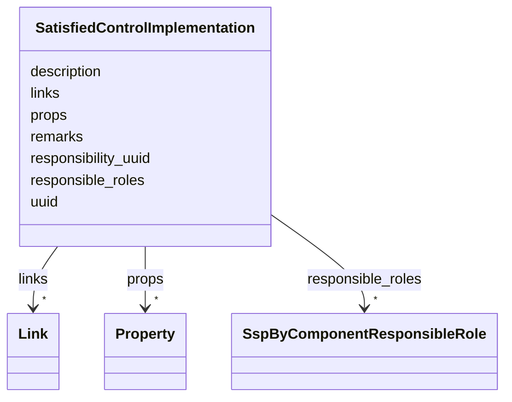

```mermaid
 classDiagram
    class SatisfiedControlImplementation
    click SatisfiedControlImplementation href "../SatisfiedControlImplementation"
      SatisfiedControlImplementation : description
        
      SatisfiedControlImplementation : links
        
          
    
        
        
        SatisfiedControlImplementation --> "*" Link : links
        click Link href "../Link"
    

        
      SatisfiedControlImplementation : props
        
          
    
        
        
        SatisfiedControlImplementation --> "*" Property : props
        click Property href "../Property"
    

        
      SatisfiedControlImplementation : remarks
        
      SatisfiedControlImplementation : responsibility_uuid
        
      SatisfiedControlImplementation : responsible_roles
        
          
    
        
        
        SatisfiedControlImplementation --> "*" SspByComponentResponsibleRole : responsible_roles
        click SspByComponentResponsibleRole href "../SspByComponentResponsibleRole"
    

        
      SatisfiedControlImplementation : uuid
        
      
```
