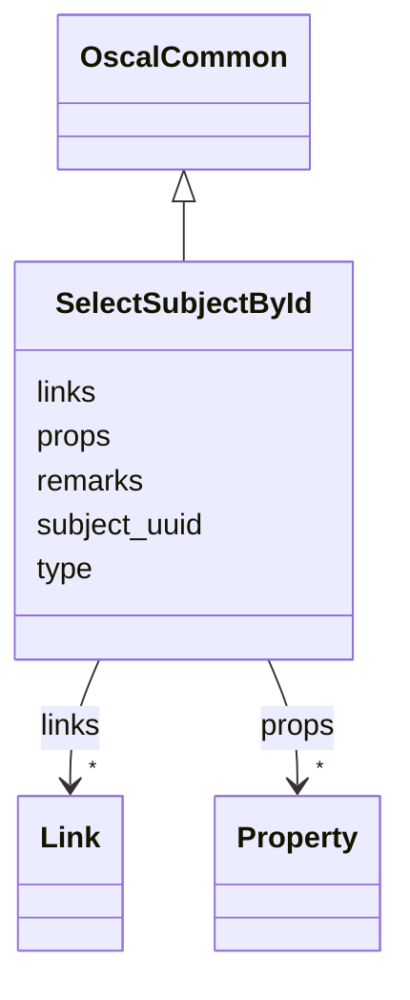

```mermaid
 classDiagram
    class SelectSubjectById
    click SelectSubjectById href "../SelectSubjectById"
      OscalCommon <|-- SelectSubjectById
        click OscalCommon href "../OscalCommon"
      
      SelectSubjectById : links
        
          
    
        
        
        SelectSubjectById --> "*" Link : links
        click Link href "../Link"
    

        
      SelectSubjectById : props
        
          
    
        
        
        SelectSubjectById --> "*" Property : props
        click Property href "../Property"
    

        
      SelectSubjectById : remarks
        
      SelectSubjectById : subject_uuid
        
      SelectSubjectById : type
        
      
```
