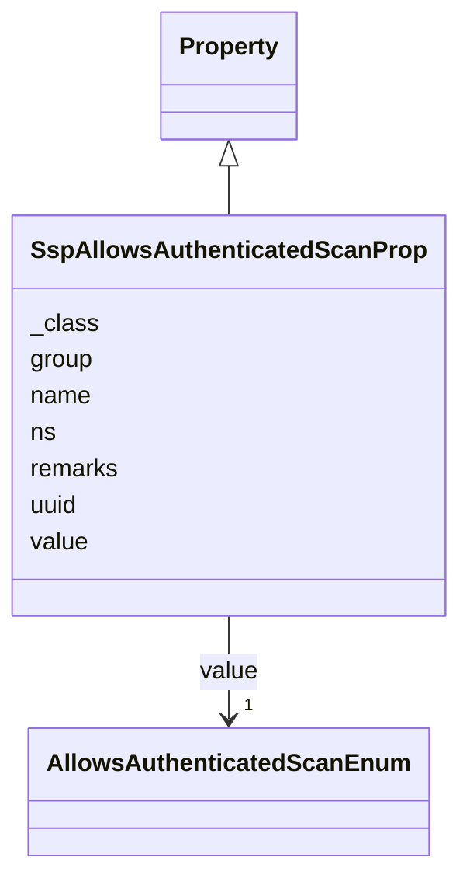

```mermaid
 classDiagram
    class SspAllowsAuthenticatedScanProp
    click SspAllowsAuthenticatedScanProp href "../SspAllowsAuthenticatedScanProp"
      Property <|-- SspAllowsAuthenticatedScanProp
        click Property href "../Property"
      
      SspAllowsAuthenticatedScanProp : _class
        
      SspAllowsAuthenticatedScanProp : group
        
      SspAllowsAuthenticatedScanProp : name
        
      SspAllowsAuthenticatedScanProp : ns
        
      SspAllowsAuthenticatedScanProp : remarks
        
      SspAllowsAuthenticatedScanProp : uuid
        
      SspAllowsAuthenticatedScanProp : value
        
          
    
        
        
        SspAllowsAuthenticatedScanProp --> "1" AllowsAuthenticatedScanEnum : value
        click AllowsAuthenticatedScanEnum href "../AllowsAuthenticatedScanEnum"
    

        
      
```
