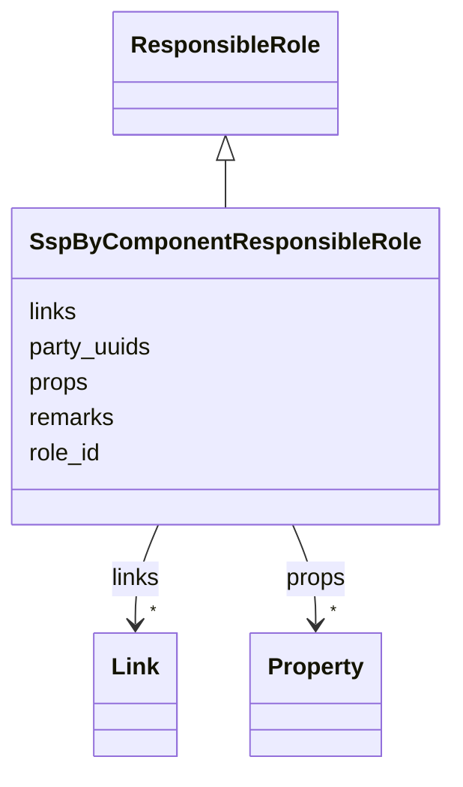

```mermaid
 classDiagram
    class SspByComponentResponsibleRole
    click SspByComponentResponsibleRole href "../SspByComponentResponsibleRole"
      ResponsibleRole <|-- SspByComponentResponsibleRole
        click ResponsibleRole href "../ResponsibleRole"
      
      SspByComponentResponsibleRole : links
        
          
    
        
        
        SspByComponentResponsibleRole --> "*" Link : links
        click Link href "../Link"
    

        
      SspByComponentResponsibleRole : party_uuids
        
      SspByComponentResponsibleRole : props
        
          
    
        
        
        SspByComponentResponsibleRole --> "*" Property : props
        click Property href "../Property"
    

        
      SspByComponentResponsibleRole : remarks
        
      SspByComponentResponsibleRole : role_id
        
      
```
