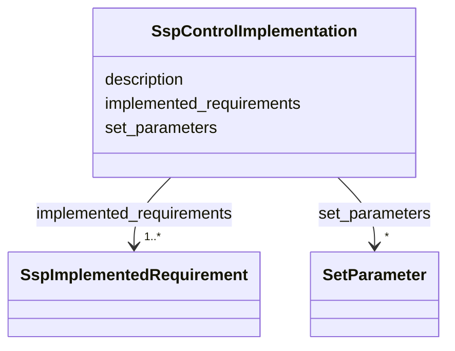

```mermaid
 classDiagram
    class SspControlImplementation
    click SspControlImplementation href "../SspControlImplementation"
      SspControlImplementation : description
        
      SspControlImplementation : implemented_requirements
        
          
    
        
        
        SspControlImplementation --> "1..*" SspImplementedRequirement : implemented_requirements
        click SspImplementedRequirement href "../SspImplementedRequirement"
    

        
      SspControlImplementation : set_parameters
        
          
    
        
        
        SspControlImplementation --> "*" SetParameter : set_parameters
        click SetParameter href "../SetParameter"
    

        
      
```
