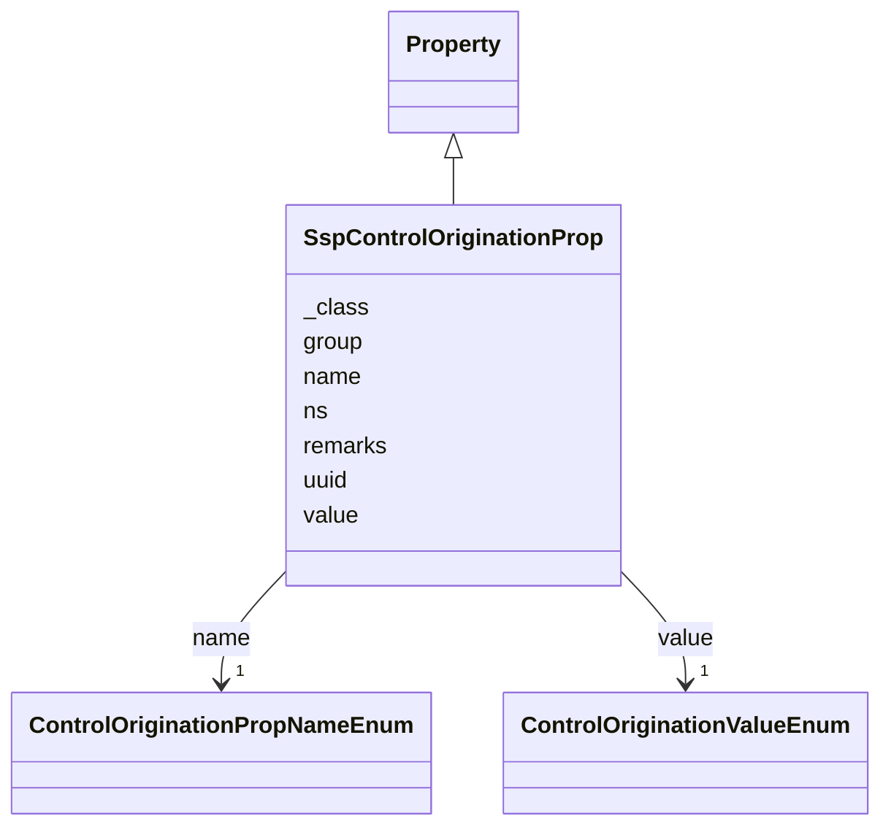

```mermaid
 classDiagram
    class SspControlOriginationProp
    click SspControlOriginationProp href "../SspControlOriginationProp"
      Property <|-- SspControlOriginationProp
        click Property href "../Property"
      
      SspControlOriginationProp : _class
        
      SspControlOriginationProp : group
        
      SspControlOriginationProp : name
        
          
    
        
        
        SspControlOriginationProp --> "1" ControlOriginationPropNameEnum : name
        click ControlOriginationPropNameEnum href "../ControlOriginationPropNameEnum"
    

        
      SspControlOriginationProp : ns
        
      SspControlOriginationProp : remarks
        
      SspControlOriginationProp : uuid
        
      SspControlOriginationProp : value
        
          
    
        
        
        SspControlOriginationProp --> "1" ControlOriginationValueEnum : value
        click ControlOriginationValueEnum href "../ControlOriginationValueEnum"
    

        
      
```
