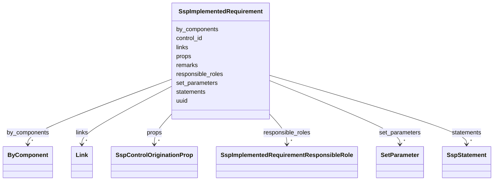

```mermaid
 classDiagram
    class SspImplementedRequirement
    click SspImplementedRequirement href "../SspImplementedRequirement"
      SspImplementedRequirement : by_components
        
          
    
        
        
        SspImplementedRequirement --> "*" ByComponent : by_components
        click ByComponent href "../ByComponent"
    

        
      SspImplementedRequirement : control_id
        
      SspImplementedRequirement : links
        
          
    
        
        
        SspImplementedRequirement --> "*" Link : links
        click Link href "../Link"
    

        
      SspImplementedRequirement : props
        
          
    
        
        
        SspImplementedRequirement --> "*" SspControlOriginationProp : props
        click SspControlOriginationProp href "../SspControlOriginationProp"
    

        
      SspImplementedRequirement : remarks
        
      SspImplementedRequirement : responsible_roles
        
          
    
        
        
        SspImplementedRequirement --> "*" SspImplementedRequirementResponsibleRole : responsible_roles
        click SspImplementedRequirementResponsibleRole href "../SspImplementedRequirementResponsibleRole"
    

        
      SspImplementedRequirement : set_parameters
        
          
    
        
        
        SspImplementedRequirement --> "*" SetParameter : set_parameters
        click SetParameter href "../SetParameter"
    

        
      SspImplementedRequirement : statements
        
          
    
        
        
        SspImplementedRequirement --> "*" SspStatement : statements
        click SspStatement href "../SspStatement"
    

        
      SspImplementedRequirement : uuid
        
      
```
