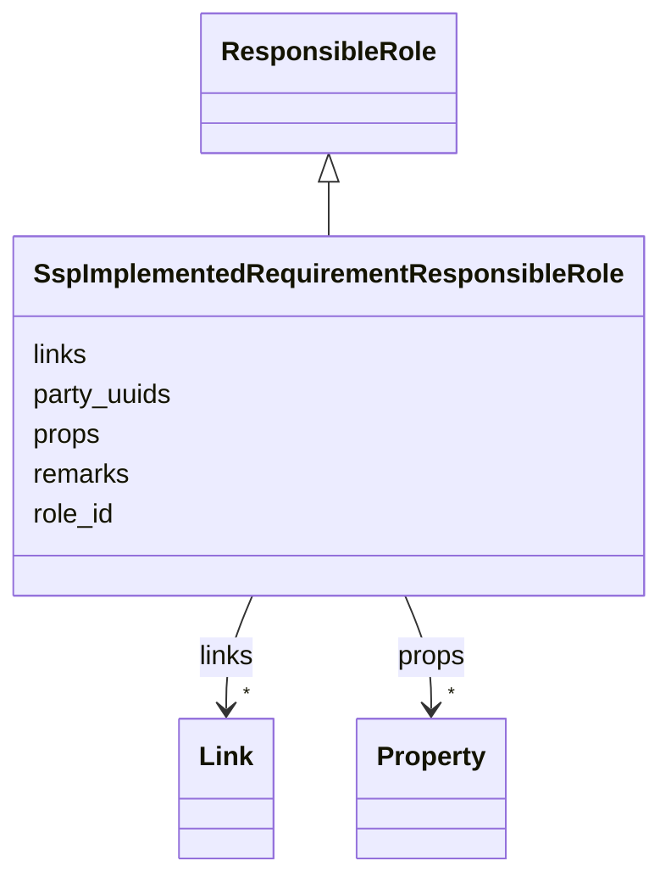

```mermaid
 classDiagram
    class SspImplementedRequirementResponsibleRole
    click SspImplementedRequirementResponsibleRole href "../SspImplementedRequirementResponsibleRole"
      ResponsibleRole <|-- SspImplementedRequirementResponsibleRole
        click ResponsibleRole href "../ResponsibleRole"
      
      SspImplementedRequirementResponsibleRole : links
        
          
    
        
        
        SspImplementedRequirementResponsibleRole --> "*" Link : links
        click Link href "../Link"
    

        
      SspImplementedRequirementResponsibleRole : party_uuids
        
      SspImplementedRequirementResponsibleRole : props
        
          
    
        
        
        SspImplementedRequirementResponsibleRole --> "*" Property : props
        click Property href "../Property"
    

        
      SspImplementedRequirementResponsibleRole : remarks
        
      SspImplementedRequirementResponsibleRole : role_id
        
      
```
