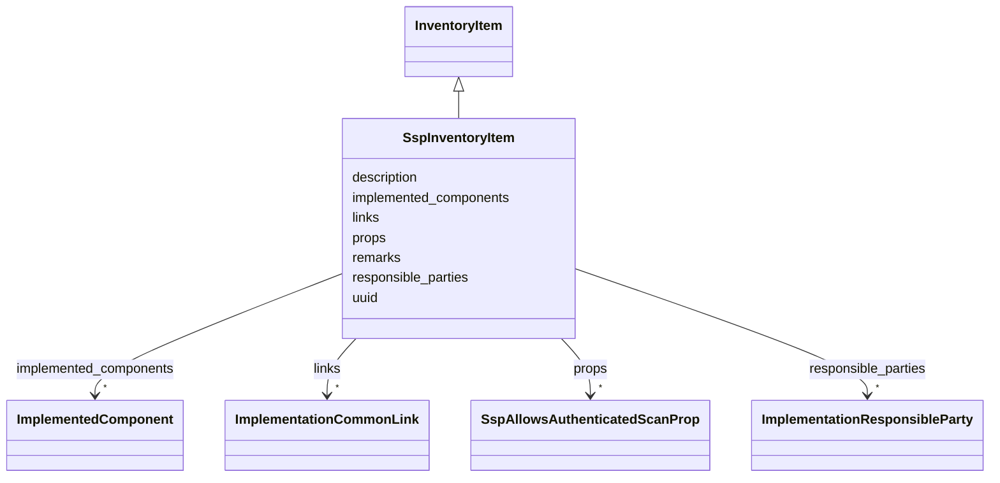

```mermaid
 classDiagram
    class SspInventoryItem
    click SspInventoryItem href "../SspInventoryItem"
      InventoryItem <|-- SspInventoryItem
        click InventoryItem href "../InventoryItem"
      
      SspInventoryItem : description
        
      SspInventoryItem : implemented_components
        
          
    
        
        
        SspInventoryItem --> "*" ImplementedComponent : implemented_components
        click ImplementedComponent href "../ImplementedComponent"
    

        
      SspInventoryItem : links
        
          
    
        
        
        SspInventoryItem --> "*" ImplementationCommonLink : links
        click ImplementationCommonLink href "../ImplementationCommonLink"
    

        
      SspInventoryItem : props
        
          
    
        
        
        SspInventoryItem --> "*" SspAllowsAuthenticatedScanProp : props
        click SspAllowsAuthenticatedScanProp href "../SspAllowsAuthenticatedScanProp"
    

        
      SspInventoryItem : remarks
        
      SspInventoryItem : responsible_parties
        
          
    
        
        
        SspInventoryItem --> "*" ImplementationResponsibleParty : responsible_parties
        click ImplementationResponsibleParty href "../ImplementationResponsibleParty"
    

        
      SspInventoryItem : uuid
        
      
```
