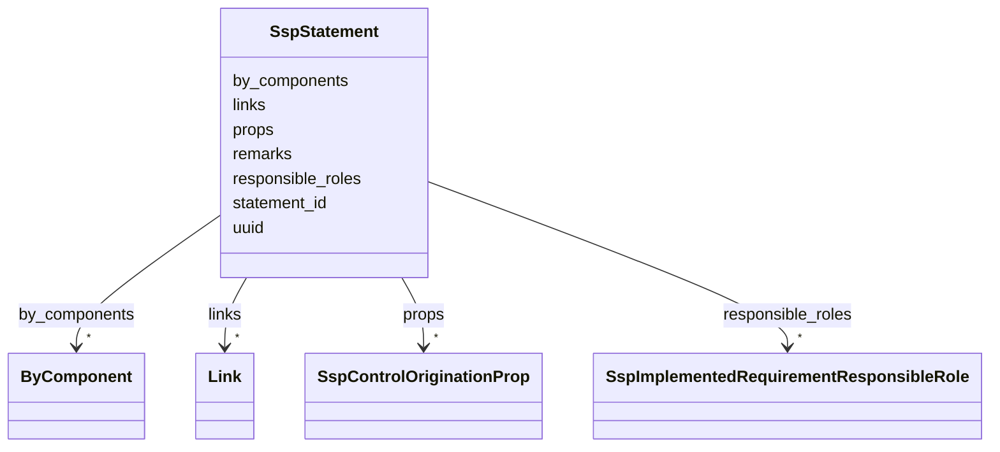

```mermaid
 classDiagram
    class SspStatement
    click SspStatement href "../SspStatement"
      SspStatement : by_components
        
          
    
        
        
        SspStatement --> "*" ByComponent : by_components
        click ByComponent href "../ByComponent"
    

        
      SspStatement : links
        
          
    
        
        
        SspStatement --> "*" Link : links
        click Link href "../Link"
    

        
      SspStatement : props
        
          
    
        
        
        SspStatement --> "*" SspControlOriginationProp : props
        click SspControlOriginationProp href "../SspControlOriginationProp"
    

        
      SspStatement : remarks
        
      SspStatement : responsible_roles
        
          
    
        
        
        SspStatement --> "*" SspImplementedRequirementResponsibleRole : responsible_roles
        click SspImplementedRequirementResponsibleRole href "../SspImplementedRequirementResponsibleRole"
    

        
      SspStatement : statement_id
        
      SspStatement : uuid
        
      
```
