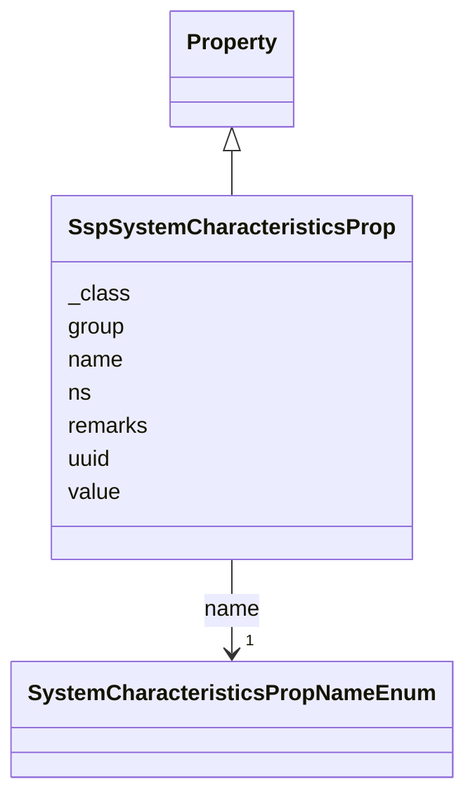

```mermaid
 classDiagram
    class SspSystemCharacteristicsProp
    click SspSystemCharacteristicsProp href "../SspSystemCharacteristicsProp"
      Property <|-- SspSystemCharacteristicsProp
        click Property href "../Property"
      
      SspSystemCharacteristicsProp : _class
        
      SspSystemCharacteristicsProp : group
        
      SspSystemCharacteristicsProp : name
        
          
    
        
        
        SspSystemCharacteristicsProp --> "1" SystemCharacteristicsPropNameEnum : name
        click SystemCharacteristicsPropNameEnum href "../SystemCharacteristicsPropNameEnum"
    

        
      SspSystemCharacteristicsProp : ns
        
      SspSystemCharacteristicsProp : remarks
        
      SspSystemCharacteristicsProp : uuid
        
      SspSystemCharacteristicsProp : value
        
      
```
