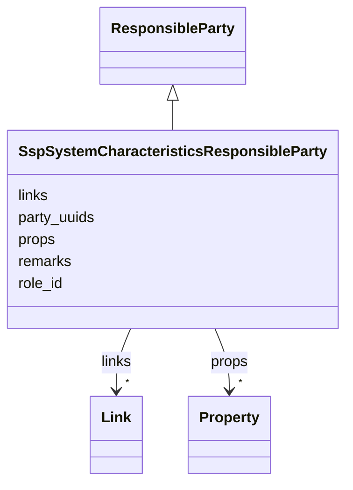

```mermaid
 classDiagram
    class SspSystemCharacteristicsResponsibleParty
    click SspSystemCharacteristicsResponsibleParty href "../SspSystemCharacteristicsResponsibleParty"
      ResponsibleParty <|-- SspSystemCharacteristicsResponsibleParty
        click ResponsibleParty href "../ResponsibleParty"
      
      SspSystemCharacteristicsResponsibleParty : links
        
          
    
        
        
        SspSystemCharacteristicsResponsibleParty --> "*" Link : links
        click Link href "../Link"
    

        
      SspSystemCharacteristicsResponsibleParty : party_uuids
        
      SspSystemCharacteristicsResponsibleParty : props
        
          
    
        
        
        SspSystemCharacteristicsResponsibleParty --> "*" Property : props
        click Property href "../Property"
    

        
      SspSystemCharacteristicsResponsibleParty : remarks
        
      SspSystemCharacteristicsResponsibleParty : role_id
        
      
```
